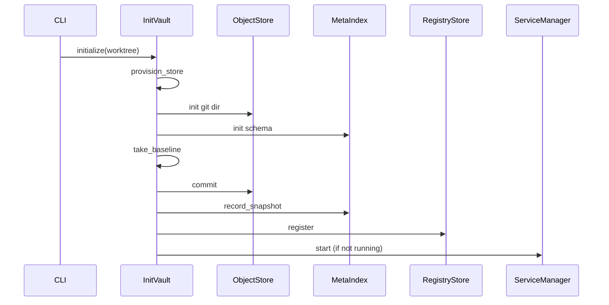
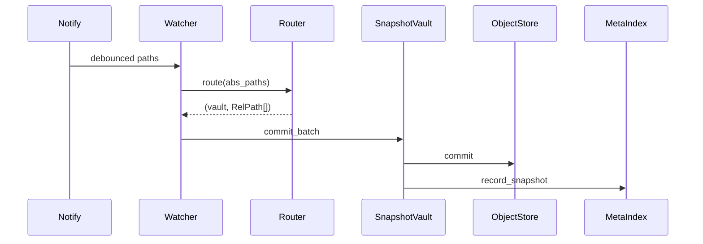

# Vault layered architecture

## Dependency rule

Dependencies point **inward**:

| Layer | May import | Must not import |
|-------|------------|-----------------|
| `domain/` | std only | ports, adapters, app, cli, daemon, watcher |
| `ports/` | `domain`, `error` | adapters, app, cli |
| `app/` | `domain`, `ports`, `error` | adapters (concrete types) |
| `adapters/` | `domain`, `ports`, `error` | app, cli |
| `cli/`, `daemon/`, `watcher/` | `app`, `domain`, `ports`, `error` | adapters (except composition root) |
| `bin/vault.rs` | everything | — (composition root) |

## Module tree

```text
src/
├── lib.rs
├── error.rs
├── domain/
│   ├── mod.rs
│   ├── rel_path.rs      # RelPath newtype (forward-slash UTF-8)
│   ├── change.rs        # FileChange, FileEventKind
│   ├── snapshot.rs      # SnapshotRecord, CommitSha
│   └── vault.rs         # VaultLayout, VaultState
├── ports/
│   ├── mod.rs
│   ├── object_store.rs  # ObjectStore trait
│   ├── meta_index.rs    # MetaIndex trait
│   ├── registry.rs      # RegistryStore trait
│   ├── service.rs       # ServiceManager trait
│   └── clock.rs         # Clock trait
├── adapters/
│   ├── mod.rs
│   ├── gix.rs           # GixObjectStore
│   ├── sqlite.rs        # SqliteMetaIndex
│   ├── toml_registry.rs # TomlRegistry
│   ├── systemd.rs       # SystemdService
│   ├── noop_service.rs  # NoopService
│   ├── detached_spawn.rs # DetachedSpawnService
│   ├── system_clock.rs  # SystemClock
│   └── fakes.rs         # InMemory*, FixedClock, RecordingServiceManager
├── app/
│   ├── mod.rs
│   ├── init.rs          # InitVault use-case
│   ├── snapshot.rs      # SnapshotVault use-case
│   ├── status.rs        # StatusQuery (read-only)
│   ├── prune.rs         # PruneRegistry
│   └── add_ignore.rs    # AddIgnore
├── cli/
│   ├── mod.rs           # Cli/Command clap defs, dispatch() — marshalling only
│   ├── context.rs       # Stores::open() — the one file allowed to name concrete adapters
│   ├── support.rs       # run_blocking(), rel_path_from_cli(), Global{vault_path,verbose}
│   └── commands/
│       ├── mod.rs        # pub mod declarations only
│       ├── init.rs, show.rs, restore.rs, log.rs, diff.rs,
│       └── status.rs, list.rs, ignore.rs, daemon.rs  # one file per subcommand: Args + run() + render
├── daemon.rs            # singleton lock, heartbeat, run_foreground
├── watcher/
│   ├── mod.rs
│   ├── router.rs
│   └── worker.rs
├── config.rs            # VaultConfig (serde DTO)
├── ignore.rs            # IgnoreMatcher
├── walk.rs
├── paths.rs             # global state dir paths only
└── bin/vault.rs         # composition root
```

## Port catalogue

### `ObjectStore`

Git object store — commit trees, read blobs at a commit.

```rust
pub trait ObjectStore: Send + Sync {
    fn commit(&self, changes: &[FileChange], message: &str)
        -> Result<Option<CommitSha>, VaultError>;
    fn read_blob(&self, commit: &CommitSha, path: &RelPath)
        -> Result<Option<Vec<u8>>, VaultError>;
}
```

### `MetaIndex`

SQLite time index — record snapshots, resolve `--at` dates.

```rust
pub trait MetaIndex: Send + Sync {
    fn record_snapshot(&self, record: &SnapshotRecord) -> Result<(), VaultError>;
    fn last_snapshot_time(&self) -> Result<Option<Timestamp>, VaultError>;
    fn resolve_at(&self, at: Timestamp) -> Result<Option<CommitSha>, VaultError>;
}
```

### `RegistryStore`

Global `registry.toml` — register vault roots, prune stale entries.

### `ServiceManager`

OS service integration — start the singleton daemon (systemd or detached spawn).

### `Clock`

Injectable wall clock for testable timestamps.

## Adapter / fake table

| Port | Production adapter | Test fake |
|------|-------------------|-----------|
| `ObjectStore` | `GixObjectStore` | `InMemoryObjectStore` |
| `MetaIndex` | `SqliteMetaIndex` | `InMemoryMetaIndex` |
| `RegistryStore` | `TomlRegistry` | `InMemoryRegistry` |
| `ServiceManager` | `SystemdService` / `NoopService` | `RecordingServiceManager` |
| `Clock` | `SystemClock` | `FixedClock` |

Fakes live in `adapters/fakes/` behind `#[cfg(any(test, feature = "testing"))]`.

## Composition root

`bin/vault.rs` (via `cli::context::Stores::open` and `cli::context::clock`, implemented in
[cli_refactor.plan.md](cli_refactor.plan.md)) wires concrete adapters:

```rust
let clock = Arc::new(SystemClock);
let service: Arc<dyn ServiceManager> = if skip_service {
    Arc::new(NoopService)
} else if systemd::is_available() {
    Arc::new(SystemdService)
} else {
    Arc::new(DetachedSpawnService)
};
```

Use-cases receive `Arc<dyn Port>` — no generics at call sites.

## Key invariants

1. **One path spelling** — `RelPath` is the only normalization; git trees and sqlite rows use `RelPath::as_str()`.
2. **No process-global CWD** — gix opens with an absolute git-dir; CWD is restored after commit operations.
3. **Read-only status** — `StatusQuery` never mutates `registry.toml`; pruning is `PruneRegistry` on daemon reload.
4. **No path auto-discovery** — commands run from the vault root or pass `--vault-path` explicitly.
5. **Ignore once** — `Router` applies `IgnoreMatcher`; downstream code trusts pre-filtered `RelPath` lists.

## Control flow (init)



## Control flow (watcher snapshot)


