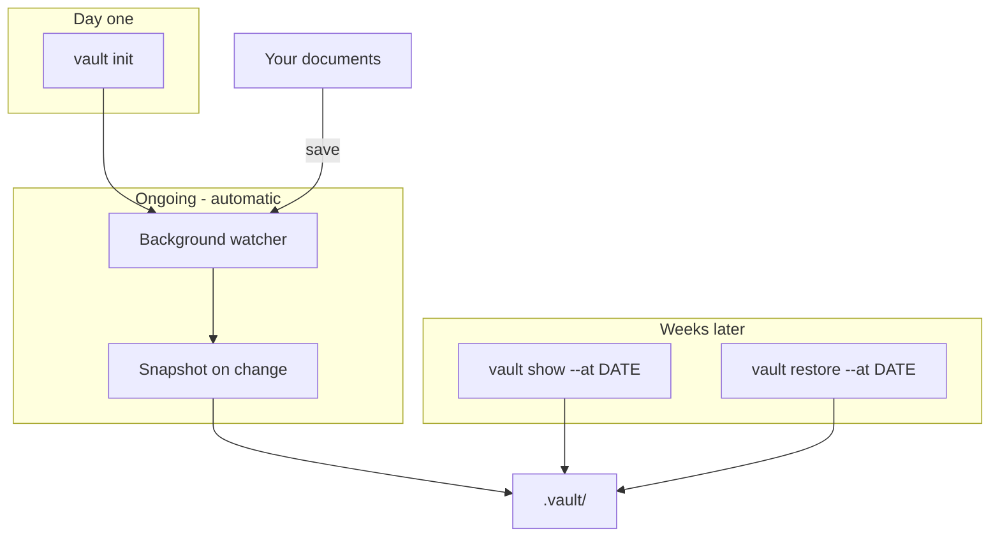
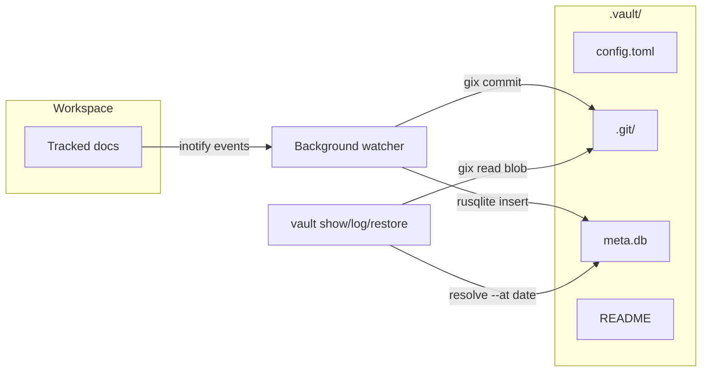
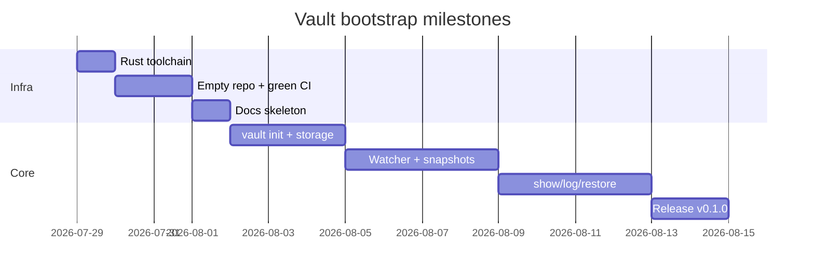

# Vault: Document Version Management — Bootstrap Plan

## Vision

A small CLI for **automatic document versioning**. Run `vault init` once in a docs directory, then forget about it. Weeks or months later, retrieve an earlier version:

```bash
vault show README.md --at 2026-06-01
vault restore design.md --at "2026-06-01 23:58"
```

No git knowledge required. No ongoing maintenance. Vault watches files in the background and records every change.

**Two design principles:**

1. **Init once, forget** — `vault init` sets up storage and starts background watching. The user never runs git commands or thinks about snapshots.
2. **Artifacts are portable** — `.vault/` uses standard formats (`.git/` layout, SQLite, TOML). A power user *can* inspect with `git`/`sqlite3`, but that is never part of the normal workflow.





---

## `.vault/` layout (portable, self-describing)

```
.vault/
├── README              # Plain-English layout guide (no tool required)
├── config.toml         # Scope, ignore globs, watcher settings
├── .git/               # Standard Git dir (objects + refs = source of truth)
└── meta.db             # SQLite index for fast time-based queries
```

| Store | Holds | Why |
|-------|-------|-----|
| **Git** (`.git/`) | Blob content, commits, trees | Standard git object store; written/read entirely via **gix** in Rust — no `git` CLI dependency |
| **SQLite** (`meta.db`) | File path → commit SHA, wall-clock timestamp, event type | Fast "latest version before DATE" without scanning full git history |
| **config.toml** | Watched roots, ignore patterns, vault metadata | Sensible defaults; rarely edited |

### Internal storage (implementation detail — not user-facing)

Git operations are implemented by the `GixObjectStore` adapter (`src/adapters/gix.rs`), which wraps the lower-level `src/storage/git.rs` helpers. Vault never shells out to the `git` binary. On `vault init`, the library:

- Creates `.vault/.git/` with standard object/ref layout (separated git-dir; work-tree = vault root)
- Never writes a `.git` file at the project root (coexists with an existing source-control repo)
- Commits snapshots with messages like `vault: update docs/arch.md @ 2026-07-29T14:32:01Z`

Users do not need to know any of this. The `.vault/README` documents the layout for recovery/forensics only.

---

## Global state (singleton daemon)

Per-user state (not per vault). Resolved via `directories` crate; override with `VAULT_STATE_DIR`:

| Platform | Default path |
|----------|--------------|
| Linux | `~/.local/share/vault/` |
| macOS | `~/Library/Application Support/vault/` |
| Windows | `%APPDATA%\vault\data\` |

```text
<state_dir>/
├── registry.toml    # list of vault roots (human-readable)
├── registry.lock    # write mutex for atomic registry updates
├── daemon.lock      # advisory lock → singleton enforcement
├── daemon.json      # heartbeat (pid, vault_count, updated_at)
└── daemon.log       # append-only daemon log
```

```toml
# registry.toml
version = 1

[[vault]]
root = "/home/me/notes"
registered_at = "2026-07-30T12:00:00Z"
enabled = true
```

`vault init` registers the vault root here, then ensures the singleton daemon is running. The daemon watches `registry.toml` itself (via `notify`) and hot-reloads its watch set when new vaults are added — no signals or IPC required, portable across OSes.

---

## CLI command design

**Primary workflow** (what users actually do):

| When | Command | Purpose |
|------|---------|---------|
| Once | `vault init` | Create `.vault/`, start background watcher — then forget |
| Later | `vault show PATH --at DATE` | View a file as it was at a given timestamp |
| Later | `vault restore PATH --at DATE` | Write an old version back (`--dry-run` supported) |
| Anytime | `vault log [PATH]` | Browse version history |
| Anytime | `vault diff PATH [--at DATE] [--to DATE]` | Compare two points in time |

**Secondary / diagnostic commands** (optional, not part of daily use):

| Command | Purpose |
|---------|---------|
| `vault status` | Is the watcher running? Last snapshot time? File count? |
| `vault list` | Tracked files and latest version timestamp |
| `vault ignore PATTERN` | Add an ignore glob (e.g. `*.pdf`) |

Global flags: `--vault-path PATH` (vault root or `.vault/` path; default `./.vault` under the current directory), `-v` / `--verbose`, `--version`, `--help`.

`<date>` accepts explicit timestamps only (MVP): `2026-06-01` (date, start of day UTC) or `2026-06-01 23:58` (date + time, local). Relative phrases (`2 weeks ago`) deferred to post-v0.1.

**Not exposed to users:** `vault watch` — watching starts automatically on `init` via a **singleton background daemon** (one process per user, all vaults). On Linux, `vault init` installs a systemd user unit (`vault-watcher.service`) that runs the hidden `vault daemon` subcommand. No manual daemon management.

**Not in v0.1** (defer): multi-machine sync, encryption, retention/prune policies, macOS/Windows.

**Naming note:** `vault` collides conceptually with HashiCorp Vault. Acceptable for a personal/docs tool; README should state scope clearly.

---

## Tech stack (Rust, Linux-first)

| Concern | Crate / tool |
|---------|----------------|
| CLI | `clap` (derive) |
| Errors | `thiserror` + `anyhow` (CLI boundary) |
| Git | `gix` — all init/commit/read in Rust; **never** shell out to `git` CLI |
| SQLite | `rusqlite` (`bundled` feature for portable builds) |
| Runtime | `tokio` (full runtime from day one — not a later add-on) |
| FS watch | `notify` + `notify-debouncer-full` (inotify / FSEvents / `ReadDirectoryChangesW`) |
| Ignore globs | `globset` |
| Baseline walk | `walkdir` |
| Singleton lock | `fs4` (advisory file lock, cross-platform) |
| State paths | `directories` (`$XDG_DATA_HOME/vault/`; override with `VAULT_STATE_DIR`) |
| Service | Service-manager adapter (systemd on Linux; launchd/Windows deferred) |
| Dates | `chrono` — snapshot timestamps (Chapter 4); CLI date parsing (Chapter 5) |
| Config | `toml` + `serde` |
| Logging | `daemon.log` append via `daemon::append_log` (structured `tracing` deferred) |

Edition **2021**, MSRV **1.75** (stable toolchain via rustup).

**Async architecture (v0.1):** `#[tokio::main]` in `src/bin/vault.rs` from Chapter 1. Watcher loop is async end-to-end (debounce timer via `tokio::time`, events via `notify` → `mpsc`). Blocking work (gix commits, rusqlite writes, file reads) runs in `tokio::task::spawn_blocking` so the watcher never stalls the runtime. CLI commands (`show`, `restore`, etc.) are async too — no sync-only code paths to refactor later.

---

## Repo layout (standard Rust binary crate)

Single crate, binary + library ([Cargo book](https://doc.rust-lang.org/cargo/guide/project-layout.html) layout). After the ports-and-adapters refactor, the crate is layered: `domain` → `ports` → `app` / `adapters` → `cli` / `daemon` / `watcher`. See [architecture.plan.md](architecture.plan.md) for the full module tree.

```
vault/
├── Cargo.toml              # [package], [dependencies], [dev-dependencies], [lints]
├── Cargo.lock              # committed (application/binary crate)
├── README.md
├── CHANGELOG.md
├── CONTRIBUTING.md
├── LICENSE
├── rustfmt.toml
├── src/
│   ├── lib.rs              # crate root; re-exports modules
│   ├── error.rs
│   ├── domain/             # pure types: RelPath, VaultLayout, FileChange, …
│   ├── ports/              # trait boundaries (ObjectStore, MetaIndex, …)
│   ├── adapters/           # gix, sqlite, toml registry, systemd, fakes
│   ├── app/                # use-cases: init, snapshot, status, prune, add_ignore
│   ├── cli/                # clap Parser, dispatch, render.rs
│   ├── config.rs           # VaultConfig (toml load/save)
│   ├── registry.rs         # global vault registry (registry.toml)
│   ├── ignore.rs           # globset builder from config
│   ├── walk.rs             # baseline file walk
│   ├── snapshot.rs         # commit orchestration (gix + sqlite)
│   ├── daemon.rs           # singleton lock, heartbeat, run_foreground
│   ├── paths.rs            # global state dir paths
│   ├── storage/
│   │   ├── mod.rs
│   │   ├── git.rs          # gix: init, commit, read blob
│   │   └── sqlite/         # schema + time-based queries
│   ├── watcher/            # notify debouncer + per-vault workers
│   │   ├── mod.rs
│   │   ├── router.rs
│   │   └── worker.rs
│   ├── service/            # re-exports ServiceManager adapters
│   │   ├── mod.rs
│   │   └── constants.rs
│   └── bin/
│       └── vault.rs        # #[tokio::main] → vault::cli::run().await (thin entry)
├── tests/                  # integration tests (one crate per *.rs file)
│   ├── init.rs
│   ├── registry.rs
│   ├── watcher.rs
│   ├── daemon.rs
│   ├── status.rs
│   ├── concurrency.rs
│   ├── storage_paths.rs
│   ├── show_at_date.rs
│   └── common/
│       └── mod.rs          # temp dirs, fixture helpers
├── docs/                   # mdBook user guide
│   ├── book.toml
│   └── src/
│       ├── SUMMARY.md
│       ├── getting_started.md
│       ├── architecture.md
│       ├── cli.md
│       └── releasing.md
├── scripts/
│   ├── ci.sh               # local CI mirror
│   └── smoke_test.sh       # end-to-end CLI smoke (run in CI)
└── .github/
    ├── dependabot.yml
    └── workflows/
        ├── ci.yml
        ├── release.yml
        └── publish.yml
```

**Cargo layout (per the book):**

- `src/lib.rs` + layered modules — the **library**; holds all logic, unit-testable.
- `src/bin/<name>.rs` — **executable entry points only**; one file = one binary. `src/bin/vault.rs` produces the `vault` binary.
- Do **not** put library modules under `src/bin/` — that directory is exclusively for `fn main()`.
- Use `src/main.rs` *or* `src/bin/vault.rs`, not both. We use `src/bin/vault.rs` so the entry point is explicit; omit `src/main.rs`.
- For v0.1, `vault daemon` (hidden) runs the singleton watcher on the same `vault` binary.

**Conventions:**

- `cargo new vault --lib`, then add `src/bin/vault.rs` — library-first crate with explicit binary path.
- Integration tests in `tests/*.rs` (not `tests/unit/` / `tests/integration/` — that's Python layout).
- `benches/` added later with `criterion` when performance matters.
- `examples/*.rs` added only if we expose a library API worth demonstrating; CLI smoke lives in `scripts/smoke_test.sh`.

**Docs hosting:** mdBook → GitHub Pages. README badges: CI, docs, crates.io, license.

**Borrowed from ontolog/pulq (process only, not layout):** green CI on every PR, `scripts/ci.sh` local mirror, conventional commits, CHANGELOG + automated release workflow, CONTRIBUTING.md.

---

## Chapter 0 — Rust toolchain (this machine)

Install and verify before any repo work:

```bash
curl --proto '=https' --tlsv1.2 -sSf https://sh.rustup.rs | sh
source "$HOME/.cargo/env"
rustup default stable
rustup component add rustfmt clippy
cargo --version && rustc --version
```

Optional but recommended:

```bash
cargo install cargo-nextest   # faster test runner (optional)
# pre-commit hook: rustfmt + clippy
```

**Current status:** GitHub repo created at `vadim-schultz/vault`; Rust tooling partially installed. Verify with `cargo --version` before Chapter 1.

---

## Chapter 1 — Empty repo, green CI (smallest shippable step)

**Goal:** Cargo project scaffolded; every push/PR passes CI; binary prints `--version`.

1. ~~Create GitHub repo `vadim-schultz/vault`.~~ Done.
2. `cargo new vault --lib`, add `src/bin/vault.rs` as the binary entry point.
3. Scaffold root files: `README.md`, `LICENSE` (MIT), `CHANGELOG.md`, `.gitignore` (target/, `.vault/` test dirs).
4. Implement minimal async CLI (`tokio` in `Cargo.toml` from the start):

```rust
// src/bin/vault.rs — #[tokio::main] async fn main()
// vault --version → "vault 0.1.0"
// vault --help   → lists stub subcommands
```

5. Add `.github/workflows/ci.yml`-style jobs:

| Job | Steps |
|-----|-------|
| `lint-test` | `cargo fmt --check`, `cargo clippy -- -D warnings`, `cargo test` |
| `build-test` | `cargo build --release`, `./target/release/vault --version` |
| `docs` | `mdbook build docs/` (stub book with one page) |

6. Add `scripts/ci.sh` mirroring those three jobs (`lint`, `build`, `docs`, `all`).
7. Add `CONTRIBUTING.md` with local setup + `./scripts/ci.sh`.
8. Merge to `main` → CI green. **Tag nothing yet.**

**Exit criteria:** `cargo test` passes; CI badge green; `vault --version` works.

---

## Chapter 2 — Documentation skeleton

**Goal:** Published docs site; architecture and CLI reference stubs.

1. `mdbook init docs/` with pages: getting started, architecture, CLI reference, releasing.
2. Document `.vault/` layout and "inspect without vault" guide in `architecture.md`.
3. Enable GitHub Pages from `gh-pages` branch or Actions artifact upload.
4. README badges: CI, docs, license.

**Exit criteria:** `mdbook build docs/` passes in CI; docs URL live.

---

## Chapter 3 — `vault init` + storage foundation

**Goal:** One command sets up everything; storage is valid git (via gix) + sqlite.

**TDD loop per project rules:**

1. **Red:** `tests/init.rs` — `vault init` creates `.vault/{README,config.toml,.git,meta.db}`; second init fails.
2. **Green:** Implement `vault::init()`:
   - Write `config.toml` with sensible defaults (watch `.`, ignore `.vault/`, editor temps)
   - Initialize `.vault/.git/` via **gix** (separated git-dir; no root `.git` file)
   - Create SQLite schema:

```sql
CREATE TABLE snapshots (
    id INTEGER PRIMARY KEY,
    commit_sha TEXT NOT NULL,
    created_at TEXT NOT NULL  -- ISO-8601 UTC
);
CREATE TABLE file_events (
    id INTEGER PRIMARY KEY,
    snapshot_id INTEGER REFERENCES snapshots(id),
    path TEXT NOT NULL,
    event_type TEXT NOT NULL,  -- create | modify | delete
    UNIQUE(snapshot_id, path)
);
CREATE INDEX idx_file_events_path_time ON file_events(path, snapshot_id);
```

3. Write `.vault/README` (recovery guide, not daily-use docs).
4. Wire `vault init` subcommand.

**Exit criteria:** integration test green; gix can write/read a test blob; `sqlite3 .vault/meta.db .schema` works. No `git` CLI in code or tests.

---

## Chapter 4 — Singleton background watcher (automatic after init)

**Goal:** After `vault init`, versioning runs without user intervention. One daemon watches all registered vaults.

**Detailed plan:** [chapter_4.plan.md](chapter_4.plan.md)

1. **Red:** tests for registry registration, multi-vault watcher, daemon singleton, `vault status`.
2. **Green:**
   - `vault init` registers vault in global `registry.toml`, takes baseline snapshot, ensures singleton daemon
   - Singleton `vault daemon` (hidden) watches `registry.toml` + all vault worktrees via `notify` + debounce
   - On stable file change → gix commit + sqlite `file_events` insert; respect `config.toml` ignore globs
   - Linux: install `vault-watcher.service` systemd user unit (one unit total, not per-directory)
3. `vault status` reports daemon health, vault count, last snapshot per vault. `vault ignore` updates config.

**Exit criteria:** edit a tracked `.md` file → snapshot within debounce window; hot-reload when registry grows; `vault status` healthy; CI uses `VAULT_NO_SERVICE=1` + `vault daemon --foreground` (no systemd in CI).

---

## Chapter 5 — Time-travel read commands

**Goal:** Core user story — "show me this doc as it was on June 1st."

1. **Red:** fixture with 3 commits at known timestamps; `vault show doc.md --at <date>` returns correct content.
2. **Green:**
   - `resolve_at(date)` → latest `snapshots.created_at <= date` (sqlite)
   - Read blob content via **gix** at resolved commit SHA
   - Implement `log`, `show`, `diff`, `restore`, `list`, `status`
3. Add `scripts/smoke_test.sh` (init → edit file → wait for snapshot → show --at) run in CI.

**Exit criteria:** integration tests for show/diff/restore; smoke script passes in CI.

---

## Chapter 6 — Release v0.1.0

**Goal:** Installable binary on Linux; crate on crates.io.

1. Bump `version = "0.1.0"` in `Cargo.toml`; update `CHANGELOG.md`.
2. Add `release.yml`-style workflow:
   - On merge to `main` with version bump → tag `v0.1.0`
   - `cargo build --release` → attach `vault-x86_64-unknown-linux-gnu` to GitHub Release
   - `cargo publish` to crates.io (with `CARGO_REGISTRY_TOKEN` secret)
3. Document release process in `docs/src/releasing.md`.

**Exit criteria:** `cargo install vault` works; GitHub Release has Linux binary; docs describe install.

---

## CI reference (target `ci.yml`)

```yaml
jobs:
  lint-test:
    runs-on: ubuntu-latest
    steps:
      - uses: actions/checkout@v4
      - uses: dtolnay/rust-toolchain@stable
        with: { components: rustfmt, clippy }
      - run: cargo fmt --all -- --check
      - run: cargo clippy -- -D warnings
      - run: cargo test
      - run: bash scripts/smoke_test.sh  # after Chapter 5

  build-test:
    runs-on: ubuntu-latest
    steps:
      - uses: actions/checkout@v4
      - uses: dtolnay/rust-toolchain@stable
      - run: cargo build --release
      - run: ./target/release/vault --version

  docs:
    runs-on: ubuntu-latest
    steps:
      - uses: actions/checkout@v4
      - run: cargo install mdbook --locked
      - run: mdbook build docs/
```

`dependabot.yml`: weekly `cargo` + `github-actions` updates.

---

## Delivery order summary



Each chapter = one feature branch → PR → green CI → merge. No chapter starts until the previous chapter's CI is green.

---

## Risks and mitigations

| Risk | Mitigation |
|------|------------|
| HashiCorp Vault name confusion | Clear README tagline: "document version history, not secrets management" |
| Watcher noise (editors, temp files) | Debounce + ignore globs in config; test with vim/emacs swap patterns |
| Date parsing ambiguity | MVP: two strict formats only (`YYYY-MM-DD`, `YYYY-MM-DD HH:MM`); document timezone rules in CLI help |
| Large binary files in docs | Ignore `*.pdf`, `*.zip` by default in `config.toml` |
| git + sqlite drift | Single code path for snapshot creation; integration tests assert both stores |
| Vault `.git` vs project `.git` | gix separated git-dir inside `.vault/` only; never write root `.git` file |
| Watcher not running after reboot | systemd user unit `vault-watcher.service` with `Restart=on-failure`; `vault status` surfaces heartbeat age |
| systemd unavailable (containers, CI) | Hidden `vault daemon --foreground` for tests; `--no-service` / `VAULT_NO_SERVICE=1` skips service install |
| inotify watch limits (many vaults) | One shared watcher instance; document `fs.inotify.max_user_watches` |
| Registry corruption | `registry.lock` + temp-rename writes; `version` field in `registry.toml` |
| Moved/deleted vault roots | Prune stale entries; warn in `vault status` |
| Daemon dies silently | Heartbeat age in `vault status`; `Restart=on-failure` in systemd unit |
| Snapshot feedback loop | `.vault/**` filtered before debounce |
| Nested vaults | Route events to deepest matching vault root |

---

## What we defer to later chapters (post-v0.1)

- Relative date phrases (`2 weeks ago`, `yesterday`)
- `vault config` subcommands (edit watch roots interactively)
- Compression / retention policies (prune old snapshots)
- launchd + Windows Task Scheduler service adapters (stubs in v0.1)
- Global cross-vault search over `registry.toml` + per-vault `meta.db`
- `vault pause` / `vault resume`
- `benches/` with `criterion` when watcher performance matters
