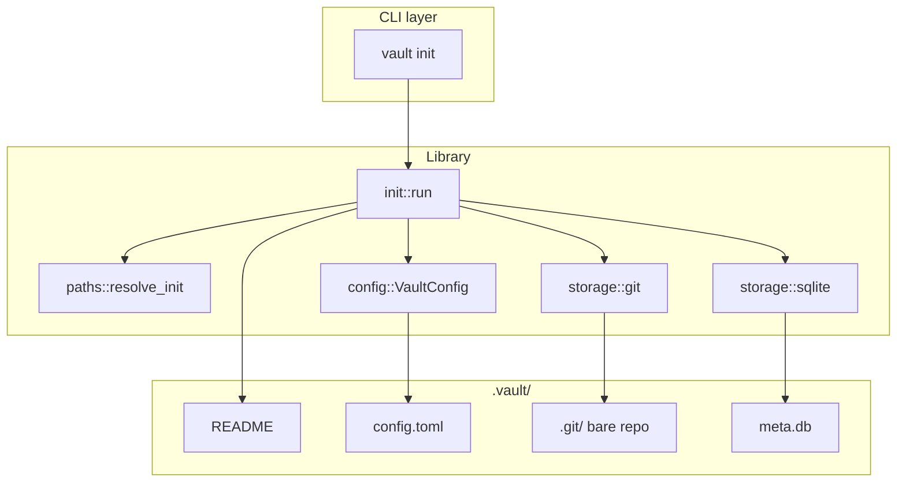

# Chapter 3 — `vault init` + storage foundation

## Context

**Prerequisites (merged):**
- [chapter_1.plan.md](/home/schult_v/projects/vault/.plans/chapter_1.plan.md) — library-first crate, async CLI stubs, CI green
- [chapter_2.plan.md](/home/schult_v/projects/vault/.plans/chapter_2.plan.md) — mdBook site, architecture docs describing target `.vault/` layout

**Parent plan:** [chapter_0.plan.md](/home/schult_v/projects/vault/.plans/chapter_0.plan.md) § Chapter 3 (lines 310–342).

**Current state:** Only [`src/cli.rs`](/home/schult_v/projects/vault/src/cli.rs) + [`tests/cli_version.rs`](/home/schult_v/projects/vault/tests/cli_version.rs). `init` calls `stub("init")`. No `gix`, `rusqlite`, `thiserror`, `serde`, or `toml` in [`Cargo.toml`](/home/schult_v/projects/vault/Cargo.toml).

**Deliverable file:** Write this plan to [`.plans/chapter_3.plan.md`](/home/schult_v/projects/vault/.plans/chapter_3.plan.md) and update [`.plans/README.md`](/home/schult_v/projects/vault/.plans/README.md) chapter status table on implementation.

---

## Goal

One command (`vault init`) creates a portable `.vault/` directory with:

| Artifact | Purpose |
|----------|---------|
| `config.toml` | Watch roots + ignore globs (sensible defaults) |
| `README` | Recovery/forensics guide (not daily-use docs) |
| `.git/` | Bare gix object store at `.vault/.git/` |
| `meta.db` | SQLite index with `snapshots` + `file_events` schema |

**Work-tree** = parent directory of `.vault/` (the vault root). **No** `.git` file at the project root.

**Not in scope:** background watcher, systemd, snapshots, `internal-watch`, vault discovery by walking up (stub `--vault-path` for init only).

---

## Exit criteria

| Check | How |
|-------|-----|
| Integration test green | `cargo test --test init` |
| All CI green | `./scripts/ci.sh all` |
| Artifacts created | `.vault/{README,config.toml,.git,meta.db}` |
| Re-init guard | Second `vault init` exits non-zero with clear message (see [Idempotency](#idempotency-not-git-s-job)) |
| gix blob R/W | Unit test in `storage/git.rs` writes and reads a blob |
| SQLite schema | Unit/integration test asserts tables + index via `rusqlite` (not `sqlite3` CLI in CI) |
| No root `.git` | Test: init inside dir with existing `.git/` leaves root `.git` untouched |
| No `git` subprocess | Grep/code review — gix only |

Manual smoke (optional, not CI): `sqlite3 .vault/meta.db .schema`

---

## Idempotency (not git's job)

**Short answer:** No. Git does not give us vault-level idempotency, and its own re-init semantics differ from what we want.

| Layer | Second `init` behavior |
|-------|------------------------|
| `git init` (CLI) | **Succeeds** — prints "Reinitialized existing Git repository" |
| `gix::create::into(…, Kind::Bare, …)` | **Fails** — bare create requires an empty destination; error is low-level, not user-facing |
| `vault init` (target) | **Fails** — explicit `VaultError::AlreadyInitialized` before touching any artifact |

**Why a vault-level guard is required:**

1. **Multi-artifact init** — `vault init` creates `config.toml`, `README`, `meta.db`, and `.git/`. Git only owns the last one. Without an early check, a second run could overwrite `config.toml` (wiping user ignore patterns from Ch 4+) before gix errors.
2. **Product semantics** — Master plan ([chapter_0.plan.md](/home/schult_v/projects/vault/.plans/chapter_0.plan.md) line 316) specifies "second init fails", not git-style reinit. Init-once-forget is the core UX.
3. **Partial-init safety** — A crashed first run may leave `.vault/.git/` without `config.toml`. Detect **any** init marker, not only `config.toml`:

```rust
fn is_initialized(vault_dir: &Path) -> bool {
    vault_dir.join("config.toml").exists()
        || vault_dir.join("meta.db").exists()
        || vault_dir.join(".git").exists()
}
```

4. **Write order** — Create git + sqlite + README first; write `config.toml` **last** so it doubles as the "fully initialized" marker. If init crashes mid-flight, re-run still fails (`.git` or `meta.db` present) rather than corrupting an existing store.

gix bare-create failure alone is insufficient: wrong error message, wrong timing (after other files may already be overwritten), and no coverage for sqlite/README.

---

## Git workflow

```bash
cd /home/schult_v/projects/vault
git checkout main && git pull
git checkout -b feat/ch3-vault-init
# TDD: tests first, then implementation
./scripts/ci.sh all
git push -u origin feat/ch3-vault-init
# PR → merge when CI green. No tag.
```

Suggested commits (conventional, can squash in PR):
1. `test(init): add integration tests for vault init`
2. `feat(init): add storage foundation with gix and sqlite`
3. `docs: mark init implemented in cli reference`

---

## Architecture



**Blocking I/O:** `init` runs sync logic inside `tokio::task::spawn_blocking` from the CLI handler so `run()` stays async without blocking the runtime (per master plan async architecture).

---

## TDD implementation order

### Phase 1 — Red: tests + deps

#### 1a. Add dependencies to [`Cargo.toml`](/home/schult_v/projects/vault/Cargo.toml)

```toml
[dependencies]
gix = "0.68"                    # pin latest stable at implementation time
rusqlite = { version = "0.32", features = ["bundled"] }
thiserror = "2"
serde = { version = "1", features = ["derive"] }
toml = "0.8"
# existing: anyhow, clap, tokio

[dev-dependencies]
tempfile = "3"
# existing: assert_cmd, predicates
```

Use `cargo add` to resolve exact versions; prefer minimal `gix` features (default is fine for init + blob I/O).

#### 1b. Create [`tests/common/mod.rs`](/home/schult_v/projects/vault/tests/common/mod.rs)

Shared helpers:

```rust
pub fn vault_bin() -> assert_cmd::Command { ... }
pub fn init_in(dir: &Path) -> assert_cmd::assert::Assert { ... }
pub fn assert_vault_layout(vault_dir: &Path) { ... }
```

- `init_in` sets `current_dir(dir)`, runs `vault init`, asserts success
- `assert_vault_layout` checks all four artifacts exist; `.git` is a directory; root has no `.git` file

#### 1c. Create [`tests/init.rs`](/home/schult_v/projects/vault/tests/init.rs)

| Test | Asserts |
|------|---------|
| `init_creates_vault_layout` | All artifacts; stdout mentions success (optional) |
| `init_rejects_second_run` | Second init → failure; stderr contains "already initialized" (or similar) |
| `init_does_not_touch_root_git` | Pre-create `root/.git/` (dir or file); after init, unchanged |
| `config_has_default_ignores` | Parse `config.toml`; contains `.vault/`, editor temps, `*.pdf` |
| `sqlite_schema_matches_spec` | Open `meta.db` with `rusqlite`; query `sqlite_master` for tables + index |

Run `cargo test --test init` — expect compile failures / test failures (red).

---

### Phase 2 — Green: library modules

#### Module map (new files)

```
src/
├── lib.rs              # add mod declarations + pub use init::run as init_vault (or pub mod init)
├── error.rs            # VaultError (thiserror)
├── paths.rs            # vault_dir / worktree resolution for init
├── config.rs           # VaultConfig + defaults + write
├── init.rs             # orchestration: init::run(worktree, vault_dir)
└── storage/
    ├── mod.rs
    ├── git.rs          # init_git_store, blob roundtrip helpers
    └── sqlite.rs       # init_meta_db, SCHEMA constant
```

Update [`src/lib.rs`](/home/schult_v/projects/vault/src/lib.rs):

```rust
pub mod cli;
pub mod config;
pub mod error;
pub mod init;
pub mod paths;
pub mod storage;

pub use cli::run;
```

#### [`src/error.rs`](/home/schult_v/projects/vault/src/error.rs)

```rust
#[derive(Debug, thiserror::Error)]
pub enum VaultError {
    #[error("vault already initialized at {path}")]
    AlreadyInitialized { path: PathBuf },

    #[error("vault directory missing parent: {path}")]
    InvalidVaultPath { path: PathBuf },

    #[error(transparent)]
    Io(#[from] std::io::Error),

    #[error("git storage error: {0}")]
    Git(String),

    #[error(transparent)]
    Sqlite(#[from] rusqlite::Error),

    #[error(transparent)]
    TomlSerialize(#[from] toml::ser::Error),
}
```

CLI maps `VaultError` → `anyhow` via `.context()` or `map_err(|e| anyhow::anyhow!(e))`.

#### [`src/paths.rs`](/home/schult_v/projects/vault/src/paths.rs)

```rust
pub struct InitPaths {
    pub worktree: PathBuf,   // vault root (parent of .vault/)
    pub vault_dir: PathBuf,  // .../worktree/.vault
}

pub fn resolve_init(vault_path: Option<PathBuf>) -> Result<InitPaths, VaultError>
```

| Input | `worktree` | `vault_dir` |
|-------|------------|-------------|
| `None` | `std::env::current_dir()` | `worktree.join(".vault")` |
| `Some(p)` | `p.parent()` (must exist) | `p` (canonicalized) |

Validate: if `is_initialized(&vault_dir)` (any of `config.toml`, `meta.db`, `.git/`) → `AlreadyInitialized`.

#### [`src/config.rs`](/home/schult_v/projects/vault/src/config.rs)

```rust
#[derive(Debug, Serialize, Deserialize, PartialEq)]
pub struct VaultConfig {
    pub watch_roots: Vec<String>,
    pub ignore: Vec<String>,
}

impl VaultConfig {
    pub fn defaults() -> Self { ... }
    pub fn write_to(&self, path: &Path) -> Result<(), VaultError>
}
```

**Default `config.toml`:**

```toml
watch_roots = ["."]

ignore = [
    ".vault/**",
    "**/*.swp",
    "**/*~",
    "**/.#*",
    "**/#*#",
    "**/*.pdf",
    "**/*.zip",
]
```

Use `toml::to_string_pretty` + `std::fs::write`. Field names match serde; document in code that `watch_roots` maps to "watch `.`" from master plan.

#### [`src/storage/sqlite.rs`](/home/schult_v/projects/vault/src/storage/sqlite.rs)

```rust
pub const SCHEMA: &str = r#"
CREATE TABLE snapshots (
    id INTEGER PRIMARY KEY,
    commit_sha TEXT NOT NULL,
    created_at TEXT NOT NULL
);
CREATE TABLE file_events (
    id INTEGER PRIMARY KEY,
    snapshot_id INTEGER REFERENCES snapshots(id),
    path TEXT NOT NULL,
    event_type TEXT NOT NULL,
    UNIQUE(snapshot_id, path)
);
CREATE INDEX idx_file_events_path_time ON file_events(path, snapshot_id);
"#;

pub fn init_meta_db(path: &Path) -> Result<(), VaultError>
```

- Create parent dirs if needed
- `Connection::open` + `execute_batch(SCHEMA)`
- Export `open_connection` for tests (or test via `init_meta_db` + query)

**Unit test:** `schema_creates_expected_tables` — query `sqlite_master`.

#### [`src/storage/git.rs`](/home/schult_v/projects/vault/src/storage/git.rs)

**Separated git-dir pattern (no root `.git` file):**

1. `gix::create::into(git_dir, Kind::Bare, Options::default())` where `git_dir = vault_dir.join(".git")`
2. Open repo: `gix::open::Options` with `git_dir` + external worktree:

```rust
pub struct GitStore {
    repo: gix::Repository,
    git_dir: PathBuf,
    worktree: PathBuf,
}

pub fn init(git_dir: &Path, worktree: &Path) -> Result<GitStore, VaultError>
pub fn write_and_read_blob_roundtrip(&self, data: &[u8]) -> Result<Vec<u8>, VaultError>
```

Implementation sketch for open after bare create:

```rust
let repo = gix::ThreadSafeRepository::open_from_paths(
    git_dir,
    Some(worktree),
    gix::open::Options::default(),
)?;
let repo = repo.to_thread_local();
repo.set_workdir(worktree, gix::refs::store::Init::AllowUnborn)?;
```

Pin exact gix API during implementation — consult `docs.rs/gix` for `0.68` if signatures differ. **Do not** write a `.git` file in `worktree`.

**Unit tests:**
- `init_creates_git_dir_with_objects` — `.git/objects`, `.git/HEAD` exist
- `blob_roundtrip` — write blob, read bytes back

No initial commit required for Ch 3 exit criteria; empty bare repo is valid. Optional: create unborn `main` ref (gix default on init).

#### [`src/init.rs`](/home/schult_v/projects/vault/src/init.rs)

```rust
pub fn run(paths: &InitPaths) -> Result<(), VaultError> {
    if is_initialized(&paths.vault_dir) {
        return Err(VaultError::AlreadyInitialized { path: paths.vault_dir.clone() });
    }
    std::fs::create_dir_all(&paths.vault_dir)?;
    storage::git::init(&paths.vault_dir.join(".git"), &paths.worktree)?;
    storage::sqlite::init_meta_db(&paths.vault_dir.join("meta.db"))?;
    write_readme(&paths.vault_dir.join("README"))?;
    VaultConfig::defaults().write_to(&paths.vault_dir.join("config.toml"))?; // last = fully-init marker
    Ok(())
}
```

**`write_readme`:** static `const README: &str` (~40 lines): layout table, pointer to `config.toml`, how to inspect with `git --git-dir=...` and `sqlite3` (recovery only), note that normal use is `vault show`/`restore`.

#### Wire CLI — [`src/cli.rs`](/home/schult_v/projects/vault/src/cli.rs)

```rust
Command::Init => {
    let paths = paths::resolve_init(cli.vault_path)?;
    let paths = paths; // move into blocking closure
    tokio::task::spawn_blocking(move || init::run(&paths))
        .await??;
    if cli.verbose {
        eprintln!("initialized vault at {}", paths.vault_dir.display());
    }
    Ok(())
}
```

Make `dispatch` async or handle init before the sync match. Prefer converting `dispatch` to `async fn dispatch(cli: Cli) -> Result<()>` to avoid special-casing.

Success message on stdout (for UX): `Vault initialized at .vault/`

---

### Phase 3 — Refactor + docs

- Ensure functions stay small (~5–15 lines); extract helpers where needed
- Update [`docs/src/cli.md`](/home/schult_v/projects/vault/docs/src/cli.md): `init` status → **Implemented**; note watcher starts in Ch 4
- Update [`docs/src/getting_started.md`](/home/schult_v/projects/vault/docs/src/getting_started.md): add `vault init` quick start section
- Update [`CHANGELOG.md`](/home/schult_v/projects/vault/CHANGELOG.md) under `## Unreleased`
- Update [`.plans/README.md`](/home/schult_v/projects/vault/.plans/README.md): Ch 3 → Complete (after merge)

---

## `.vault/README` content outline

```text
# Vault storage (recovery guide)

This directory is managed by the `vault` CLI. You normally do not edit it.

Layout:
  config.toml  — watch roots and ignore patterns
  .git/        — git object store (file content history)
  meta.db      — SQLite index (paths, timestamps, commit SHAs)

Inspect without vault (optional):
  git --git-dir=.vault/.git log --oneline
  sqlite3 .vault/meta.db ".schema"

Daily use: vault show PATH --at DATE
```

---

## Test matrix summary

| Layer | File | Cases |
|-------|------|-------|
| Integration | `tests/init.rs` | layout, idempotency, root `.git` coexistence, config defaults, schema |
| Unit | `storage/git.rs` | bare init, blob roundtrip |
| Unit | `storage/sqlite.rs` | schema tables + index |
| Unit | `paths.rs` | resolve with/without `--vault-path`, already-init error |
| Existing | `tests/cli_version.rs` | unchanged |

---

## Verification checklist

```bash
cargo fmt --all
cargo clippy -- -D warnings
cargo test
cargo test --test init
./target/debug/vault init          # in empty temp dir
./target/debug/vault init          # fails second time
ls -la .vault/                     # README config.toml meta.db .git/
test ! -e .git                     # no root .git file
./scripts/ci.sh all
```

---

## Risks and mitigations

| Risk | Mitigation |
|------|------------|
| gix API churn | Pin version in `Cargo.lock`; blob test catches breakage |
| Partial init on crash | `is_initialized()` checks `.git/`, `meta.db`, or `config.toml`; write `config.toml` last; re-run fails rather than corrupting |
| `--vault-path` semantics | Init: path **is** `.vault/` dir; document in cli.md; full auto-discovery deferred to Ch 5 |
| Clippy pedantic on gix errors | Map gix errors to `VaultError::Git` with display string |

---

## Deferred to Chapter 4+

| Item | Chapter |
|------|---------|
| Background watcher, `notify`, debounce | 4 |
| systemd user unit, `internal-watch` | 4 |
| Snapshot commits + `file_events` inserts | 4 |
| Walk-up `.vault/` discovery for other subcommands | 4–5 |
| `chrono`, date parsing | 5 |
| `scripts/smoke_test.sh` | 5 |
