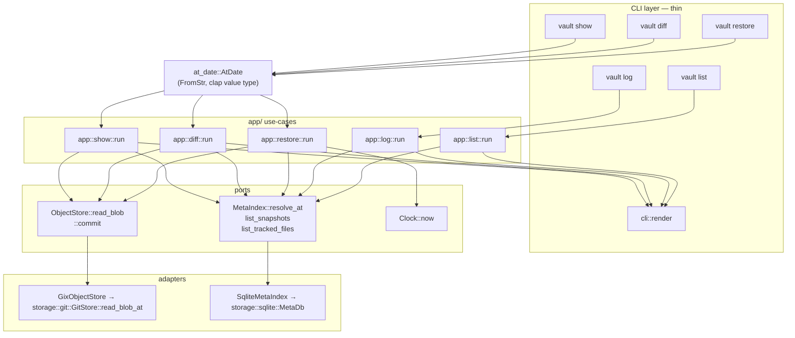

# Chapter 5 — Time-travel read commands

## Context

**Prerequisites (merged):** Chapters 1–4 + ports/adapters refactor. `vault init` + baseline snapshot,
singleton watcher, `vault status`/`vault ignore` all work. `MetaIndex::resolve_at` **already exists**
with a passing contract test (`src/ports/meta_index.rs`, `src/storage/sqlite/mod.rs`) — it was added
ahead of schedule in Chapter 4. `ObjectStore::read_blob` is a stub returning `Ok(None)` with a
`// Chapter 5` comment (`src/adapters/gix.rs:68-75`).

**Parent plan:** [chapter_0.plan.md](chapter_0.plan.md) § Chapter 5.

**Current state of the six user-facing subcommands:**

| Command | Status before this chapter |
|---------|-----------------------------|
| `init` | Implemented (Ch 3–4) |
| `status` | Implemented (Ch 4) |
| `ignore` | Implemented (Ch 4) |
| `show` / `restore` / `log` / `diff` / `list` | `stub("name")` → `bail!` |

**What this chapter actually builds**, since `resolve_at` is done:

1. `ObjectStore::read_blob` (gix tree lookup by path at a commit)
2. Two new `MetaIndex` query methods: `list_snapshots` (log) and `list_tracked_files` (list)
3. A standalone `AtDate` date value type (not a CLI concern — see Decision #2)
4. Five `app/` use-cases: `show`, `log`, `list`, `diff`, `restore`
5. CLI wiring + output rendering (thin — see "Code style" below)
6. `scripts/smoke_test.sh` wired into CI

---

## Git workflow

Always start a chapter from a clean, up-to-date `main` — never build on top of `main` directly or
on a stale/forgotten branch. This is now a standing project rule (see repo `CLAUDE.md`), not just
a Chapter 5 note.

```bash
cd /Users/vadim/projects/vault
git checkout main && git pull
git checkout -b feat/ch5-time-travel
# TDD: tests first, then implementation, phase by phase (see below)
./scripts/ci.sh all
git push -u origin feat/ch5-time-travel
# PR → merge when CI green. No tag.
```

---

## Decisions baked into this plan (flag before executing if you'd choose differently)

These are judgment calls the master plan left open. Each is small but shapes several files below.

| # | Decision | Rationale |
|---|----------|-----------|
| 1 | `--at`/`--to` accept a **third** format beyond the master plan's two: full RFC3339 (e.g. `2026-06-01T14:32:01+00:00`), in addition to `YYYY-MM-DD` and `YYYY-MM-DD HH:MM` (local). | `vault log` prints exact stored timestamps; without RFC3339 support those timestamps aren't round-trippable back into `--at`/`--to`. Needed for the smoke script and generally useful. Documented in `cli.md`, not hidden. |
| 2 | Date parsing lives entirely outside `cli/`, in a new standalone value type `at_date::AtDate` (`src/at_date.rs`) with one **named constructor per accepted format** — `AtDate::from_calendar_date`, `AtDate::from_local_date_time`, `AtDate::from_rfc3339` — plus `AtDate::parse` (tries each in turn) and `FromStr` (delegates to `parse`, so it can be used directly as a clap value type). `cli/mod.rs` never branches on date syntax; it only ever calls `AtDate::as_str()` on an already-validated value clap handed it. | You asked for the CLI to be a genuinely thin wrapper with zero parsing logic, and for a normalized type with per-format "classmethod"-style constructors (mirroring how you'd model this in Python). Each constructor is independently unit-testable and single-purpose; `parse`'s only job is to try them in order. |
| 3 | `vault restore` **writes the file and then commits it** through the existing `app::snapshot::commit` pipeline, tagged with a new `FileEventKind::Restore` (distinct from `Create`/`Modify`/`Delete` in `vault log` output and in the git commit message's verb: `vault: restore doc.md @ ...`). | You're right that "restore doesn't version itself" was odd — a restore is a real, deliberate change and should show up as its own snapshot immediately, not depend on the watcher eventually noticing. Reusing `snapshot::commit` (rather than writing a second commit path) keeps one single writer of `.vault/.git` + `meta.db`. If the watcher's debounce also fires for the same on-disk write, `ObjectStore::commit` already short-circuits when the tree is unchanged (see `storage/git.rs::commit_tree_inner`), so at most one harmless no-op follow-up commit attempt happens — no duplicate snapshot. |
| 4 | `vault diff PATH` semantics: neither flag → last snapshot vs. working tree; `--at` only → that snapshot vs. working tree; both → snapshot vs. snapshot; `--to` **without** `--at` is a CLI usage error. | Matches `git diff` / `git diff HEAD` intuition. `--to` alone has no natural meaning (diff *to* what start point?), so it's rejected before calling into `app::diff` rather than silently guessing. |
| 5 | Diff rendering (line-level unified diff via the new `similar` crate) lives in `cli::render`, not `app::diff`. `app::diff::run` returns raw bytes for both sides + labels only. | Keeps a third-party formatting library out of the use-case layer; `app/` stays about data retrieval, `cli/render.rs` stays the one place that turns data into text (matches the existing `StatusReport`/`Display` pattern). |
| 6 | `app/show.rs`, `app/diff.rs`, `app/restore.rs` are unit-tested against **real** `GixObjectStore` + `SqliteMetaIndex` in a tempdir, not `InMemoryObjectStore`. | `InMemoryObjectStore` (`adapters/fakes.rs`) records which paths changed per commit but never stores blob bytes — it was built for snapshot-pipeline coordination tests, not content retrieval. Teaching it to store content just for this chapter would be scope creep on a fake that other tests rely on staying simple. Real adapters in a tempdir are just as fast and exercise the actual gix read path. |
| 7 | Fixture timestamps in integration tests are **backdated by direct SQL `UPDATE`** after a real commit, not produced by sleeping across wall-clock boundaries. | `commit_batch` (used by `tests/watcher.rs` already) uses the real `SystemClock`, so two commits in a fast test are typically milliseconds apart — useless for asserting `--at` resolves to a *specific* one of three dates. Backdating `meta.db.snapshots.created_at` after a real commit keeps the git content and commit graph real while making timestamps deterministic. `rusqlite` is already a dev-dependency. |
| 8 | Integration tests that exercise the local-time `HH:MM` format pin `TZ=UTC` on the subprocess env. | Avoids CI-host-timezone flakiness. `assert_cmd::Command::env` already supports this; no code changes needed. |

If any of these don't match your intent, adjust the relevant section before implementing — everything downstream (module names, test fixtures, docs) assumes them.

---

## Code style for this chapter

Follow Sandi Metz's rules as a *direction*, not a hard gate: aim for roughly 5 lines per method,
roughly 100 lines per `impl`/module section, and one level of branching per method. Concretely,
in every sketch below:

- **One function per match arm/branch** when a branch does more than return a literal — e.g.
  `MetaDb::list_snapshots` dispatches to `list_all_snapshots`/`list_snapshots_for_path` rather than
  inlining both query bodies in a `match`.
- **No nested `match`/`let-else` inside a match arm.** If resolving a value takes more than one
  step, extract a helper (see `app::diff::resolve_side` / `resolve_timestamp` below) instead of
  stacking control flow three levels deep.
- **`cli/mod.rs` handlers only orchestrate**: resolve a layout, build adapters, call exactly one
  `app::` function, print the result. Any "what does this flag combination mean" logic (e.g.
  `--to` requires `--at`) is a one-line guard at the top of the handler, not embedded in an `app/`
  use-case — but the use-case itself must stay decision-free about CLI syntax, only about domain
  rules (see Decision #2).

This isn't a new rule invented for Chapter 5 — it's how `app/init.rs` and `app/snapshot.rs`
already read (small `provision_store`/`take_baseline`/`register_globally` helpers instead of one
long `run`). This chapter should look the same.

---

## Goal

Core user story end-to-end: `vault show doc.md --at 2026-06-01` returns the content as it was on
that date, with `log`/`diff`/`restore`/`list` filling out the rest of the read-facing surface.

## Exit criteria

| Check | How |
|-------|-----|
| Unit tests green | `cargo test` (domain, ports contract, storage/git read, app use-cases) |
| Integration tests green | `cargo test --test show --test log --test diff --test restore --test list` |
| Smoke script passes | `bash scripts/smoke_test.sh` locally and in CI |
| All CI green | `./scripts/ci.sh all` |
| No stubs left | `grep -n 'stub(' src/cli/mod.rs` matches nothing |
| Clippy clean | `cargo clippy -- -D warnings` (pedantic lints stay on) |

---

## Architecture



## Module map (new/changed files)

```text
src/
├── at_date.rs                          # NEW: AtDate value type — from_calendar_date,
│                                        #      from_local_date_time, from_rfc3339, parse, FromStr
├── domain/
│   ├── change.rs                        # + FileEventKind::Restore, ::parse (reverse of as_str)
│   ├── history.rs                        # NEW: SnapshotEntry, TrackedFile
│   └── mod.rs                             # + pub mod history; re-exports
├── ports/
│   └── meta_index.rs                       # + list_snapshots, list_tracked_files (+ contract tests)
├── adapters/
│   ├── gix.rs                                # read_blob wired to GitStore::read_blob_at
│   ├── sqlite.rs                              # MetaIndex::list_snapshots/list_tracked_files impl
│   └── fakes.rs                                # InMemoryMetaIndex: same two methods
├── storage/
│   ├── git.rs                                    # + GitStore::read_blob_at;
│   │                                              #   tree_handler_for routes Restore → upsert
│   └── sqlite/
│       ├── queries.rs                              # + SELECT_ALL_SNAPSHOTS,
│       │                                            #   SELECT_SNAPSHOTS_FOR_PATH, SELECT_TRACKED_FILES
│       └── mod.rs                                    # + MetaDb::list_snapshots (dispatch) +
│                                                      #   list_all_snapshots/list_snapshots_for_path (private)
├── app/
│   ├── show.rs                                         # NEW
│   ├── log.rs                                           # NEW
│   ├── list.rs                                           # NEW
│   ├── diff.rs                                            # NEW
│   ├── restore.rs                                          # NEW (writes, then commits)
│   ├── snapshot.rs                                          # commit() returns Option<CommitSha>;
│   │                                                        #   message verb depends on FileEventKind
│   └── mod.rs                                                # + pub mod {show,log,list,diff,restore}
├── cli/
│   ├── mod.rs                                                  # thin per-command async handlers;
│   │                                                            #   Command variants use AtDate
│   └── render.rs                                                # + formatting for log/list/diff
├── error.rs                                                      # + NoSnapshotAt, PathNotTrackedAt,
│                                                                  #   CorruptMetaIndex, InvalidDate
Cargo.toml                                                          # + similar = "2"
tests/
├── show.rs      # NEW
├── log.rs        # NEW
├── diff.rs        # NEW
├── restore.rs      # NEW
├── list.rs          # NEW
└── common/mod.rs      # + write_and_commit, backdate_last_snapshot
scripts/
└── smoke_test.sh        # NEW
.github/workflows/ci.yml    # + smoke script step
docs/src/cli.md               # status table + new sections
CHANGELOG.md                    # Unreleased entries
.plans/README.md                  # Chapter 5 → Complete (after merge)
CLAUDE.md                           # NEW: project rule — fresh main + feature branch per chapter
```

---

## TDD implementation order

### Phase 1 — Foundation types (Red → Green)

#### 1a. `Cargo.toml`

```toml
[dependencies]
similar = "2"   # pin exact version at implementation time via `cargo add similar`
```

#### 1b. `src/domain/change.rs` — new variant + reverse mapping

```rust
#[derive(Debug, Clone, Copy, PartialEq, Eq)]
pub enum FileEventKind {
    Create,
    Modify,
    Delete,
    /// Content was written by `vault restore`, not an organic edit.
    Restore,
}

impl FileEventKind {
    #[must_use]
    pub const fn as_str(self) -> &'static str {
        match self {
            Self::Create => "create",
            Self::Modify => "modify",
            Self::Delete => "delete",
            Self::Restore => "restore",
        }
    }

    /// Parse a stored `event_type` string back into its enum value.
    #[must_use]
    pub fn parse(s: &str) -> Option<Self> {
        match s {
            "create" => Some(Self::Create),
            "modify" => Some(Self::Modify),
            "delete" => Some(Self::Delete),
            "restore" => Some(Self::Restore),
            _ => None,
        }
    }
}
```

Unit tests (red first): `parse_round_trips_as_str` — for all four variants, `parse(v.as_str()) ==
Some(v)`; `parse("bogus") == None`.

`PathKind::classify` (used only by the filesystem watcher) still returns just
`Create`/`Modify`/`Delete` — unchanged. `Restore` is only ever produced by `app::restore::run`
(Phase 4), never by a filesystem event.

#### 1c. `src/domain/history.rs` (new)

```rust
//! Read models for time-travel queries (`log`, `list`).

use super::change::FileEventKind;
use super::rel_path::RelPath;
use super::snapshot::CommitSha;

/// One snapshot entry returned by `log`, optionally scoped to a path.
#[derive(Debug, Clone, PartialEq, Eq)]
pub struct SnapshotEntry {
    /// Commit object id.
    pub commit_sha: CommitSha,
    /// ISO-8601 UTC timestamp.
    pub created_at: String,
    /// Event kind for the queried path; `None` when `log` was not scoped to a path.
    pub event: Option<FileEventKind>,
}

/// A tracked file and the timestamp of its most recent non-delete snapshot.
#[derive(Debug, Clone, PartialEq, Eq)]
pub struct TrackedFile {
    /// Path relative to the vault worktree.
    pub path: RelPath,
    /// ISO-8601 UTC timestamp of the latest recorded change.
    pub last_modified: String,
}
```

Update `src/domain/mod.rs`:

```rust
pub mod history;
pub use history::{SnapshotEntry, TrackedFile};
```

No standalone unit test here (plain data); covered indirectly by the Phase 2 port contract tests.

#### 1d. `src/error.rs` — new variants

```rust
/// No snapshot exists at or before the requested timestamp.
#[error("no snapshot at or before {at}")]
NoSnapshotAt {
    /// The requested timestamp (UTC RFC3339).
    at: String,
},

/// The path did not exist (or was deleted) in the resolved snapshot.
#[error("{path} was not tracked at {at}")]
PathNotTrackedAt {
    /// The requested path.
    path: String,
    /// The requested timestamp (UTC RFC3339).
    at: String,
},

/// `meta.db` contained a value outside the schema's expected domain.
#[error("corrupt metadata index: {detail}")]
CorruptMetaIndex {
    /// Human-readable description of the unexpected value.
    detail: String,
},

/// A `--at`/`--to` value did not match any accepted date format.
#[error("invalid date '{input}' (expected YYYY-MM-DD, YYYY-MM-DD HH:MM, or RFC3339)")]
InvalidDate {
    /// The raw input string.
    input: String,
},
```

Unit test mirroring the existing `invalid_glob_is_not_io_error` style: construct each variant,
assert `matches!`.

#### 1e. `src/at_date.rs` (new) — the date value type

This is **not** a CLI module. It has no dependency on `clap`; it becomes a clap value type purely
by implementing `FromStr`. Placed as a flat top-level module (same convention as `config.rs`,
`registry.rs`) since it's pure computation shared potentially beyond the CLI, not I/O.

```rust
//! `AtDate` — a validated point in time for time-travel queries.
//!
//! Three accepted textual forms, each with its own constructor: `YYYY-MM-DD` (start of day,
//! UTC), `YYYY-MM-DD HH:MM` (local time), and full RFC3339 (exact — what `vault log` prints, so
//! its output round-trips back into `--at`/`--to`). Internally always stored as a UTC RFC3339
//! string so plain string comparison against `MetaIndex::resolve_at`'s `created_at` column stays
//! chronologically correct — every producer of that column must also normalize to UTC.

use std::str::FromStr;

use chrono::{DateTime, Local, NaiveDate, NaiveDateTime, TimeZone, Utc};

use crate::error::VaultError;

const DATE_FMT: &str = "%Y-%m-%d";
const DATE_TIME_FMT: &str = "%Y-%m-%d %H:%M";

/// A CLI timestamp argument, resolved to a UTC RFC3339 string.
#[derive(Debug, Clone, PartialEq, Eq)]
pub struct AtDate(String);

impl AtDate {
    /// Return the resolved UTC RFC3339 string.
    #[must_use]
    pub fn as_str(&self) -> &str {
        &self.0
    }

    /// Try each accepted format in turn: calendar date, local date-time, then RFC3339.
    ///
    /// # Errors
    ///
    /// Returns [`VaultError::InvalidDate`] when `input` matches none of them.
    pub fn parse(input: &str) -> Result<Self, VaultError> {
        Self::from_calendar_date(input)
            .or_else(|_| Self::from_local_date_time(input))
            .or_else(|_| Self::from_rfc3339(input))
            .map_err(|_| VaultError::InvalidDate { input: input.to_string() })
    }

    /// Parse `YYYY-MM-DD` as UTC midnight.
    ///
    /// # Errors
    ///
    /// Returns [`VaultError::InvalidDate`] when `input` isn't a valid calendar date.
    pub fn from_calendar_date(input: &str) -> Result<Self, VaultError> {
        let date = NaiveDate::parse_from_str(input, DATE_FMT)
            .map_err(|_| VaultError::InvalidDate { input: input.to_string() })?;
        let midnight = date.and_hms_opt(0, 0, 0).expect("midnight is always valid");
        Ok(Self(Utc.from_utc_datetime(&midnight).to_rfc3339()))
    }

    /// Parse `YYYY-MM-DD HH:MM` as local time, converted to UTC.
    ///
    /// # Errors
    ///
    /// Returns [`VaultError::InvalidDate`] when `input` doesn't match the format or names an
    /// ambiguous/nonexistent local time (DST transition).
    pub fn from_local_date_time(input: &str) -> Result<Self, VaultError> {
        let naive = NaiveDateTime::parse_from_str(input, DATE_TIME_FMT)
            .map_err(|_| VaultError::InvalidDate { input: input.to_string() })?;
        let local = Local
            .from_local_datetime(&naive)
            .single()
            .ok_or_else(|| VaultError::InvalidDate { input: input.to_string() })?;
        Ok(Self(local.with_timezone(&Utc).to_rfc3339()))
    }

    /// Parse an exact RFC3339 timestamp (any offset, normalized to UTC on output).
    ///
    /// # Errors
    ///
    /// Returns [`VaultError::InvalidDate`] when `input` isn't valid RFC3339.
    pub fn from_rfc3339(input: &str) -> Result<Self, VaultError> {
        let exact = DateTime::parse_from_rfc3339(input)
            .map_err(|_| VaultError::InvalidDate { input: input.to_string() })?;
        Ok(Self(exact.with_timezone(&Utc).to_rfc3339()))
    }
}

impl FromStr for AtDate {
    type Err = VaultError;

    fn from_str(input: &str) -> Result<Self, Self::Err> {
        Self::parse(input)
    }
}
```

Unit tests (red first):

```rust
#[test]
fn from_calendar_date_is_utc_midnight() {
    assert_eq!(
        AtDate::from_calendar_date("2026-06-01").unwrap().as_str(),
        "2026-06-01T00:00:00+00:00"
    );
}

#[test]
fn from_local_date_time_converts_host_timezone_to_utc() {
    // Compute the expected value independently via chrono::Local so this test
    // passes regardless of the host's timezone.
    let naive = NaiveDateTime::parse_from_str("2026-06-01 23:58", DATE_TIME_FMT).unwrap();
    let expected = Local
        .from_local_datetime(&naive)
        .single()
        .unwrap()
        .with_timezone(&Utc)
        .to_rfc3339();
    assert_eq!(
        AtDate::from_local_date_time("2026-06-01 23:58").unwrap().as_str(),
        expected
    );
}

#[test]
fn from_rfc3339_round_trips_utc_input() {
    let input = "2026-06-01T14:32:01+00:00";
    assert_eq!(AtDate::from_rfc3339(input).unwrap().as_str(), input);
}

#[test]
fn parse_accepts_all_three_formats() {
    assert!(AtDate::parse("2026-06-01").is_ok());
    assert!(AtDate::parse("2026-06-01 23:58").is_ok());
    assert!(AtDate::parse("2026-06-01T14:32:01+00:00").is_ok());
}

#[test]
fn parse_rejects_garbage() {
    assert!(matches!(AtDate::parse("not-a-date"), Err(VaultError::InvalidDate { .. })));
}

#[test]
fn from_str_delegates_to_parse() {
    assert_eq!(
        "2026-06-01".parse::<AtDate>().unwrap(),
        AtDate::from_calendar_date("2026-06-01").unwrap()
    );
}
```

Add `pub mod at_date;` to `src/lib.rs`.

#### 1f. `tests/common/mod.rs` — deterministic fixtures

```rust
use rusqlite::{params, Connection};
use vault::domain::{RelPath, VaultLayout};

/// Write `content` to `rel` (relative to `worktree`) and commit it via the real
/// snapshot pipeline (bypassing the watcher's debounce).
pub fn write_and_commit(worktree: &Path, rel: &str, content: &[u8]) {
    fs::write(worktree.join(rel), content).expect("write");
    let layout = VaultLayout::from_worktree(worktree.to_path_buf());
    vault::watcher::worker::commit_batch(&layout, &[RelPath::parse(rel)]).expect("commit");
}

/// Overwrite the most recently inserted snapshot's `created_at`, for deterministic
/// `--at` fixtures. Must be called immediately after `write_and_commit`.
pub fn backdate_last_snapshot(worktree: &Path, created_at: &str) {
    let db_path = worktree.join(VAULT_DIR).join(META_DB);
    let conn = Connection::open(db_path).expect("open meta.db");
    conn.execute(
        "UPDATE snapshots SET created_at = ?1 WHERE id = (SELECT MAX(id) FROM snapshots)",
        params![created_at],
    )
    .expect("backdate");
}

/// Convenience: write + commit + backdate in one call.
pub fn snapshot_at(worktree: &Path, rel: &str, content: &[u8], created_at: &str) {
    write_and_commit(worktree, rel, content);
    backdate_last_snapshot(worktree, created_at);
}
```

Add `rusqlite` to the `use` list; it's already a dev-dependency. These helpers are exercised for
the first time by the Phase 6 integration tests but belong here since every one of those test
files needs them (avoids duplicating fixture code five times).

---

### Phase 2 — `MetaIndex` query extension (Red → Green)

#### 2a. Port trait — `src/ports/meta_index.rs`

```rust
/// List snapshots, optionally scoped to `path`, newest first.
fn list_snapshots(&self, path: Option<&RelPath>) -> Result<Vec<SnapshotEntry>, VaultError>;

/// List tracked files whose latest event is not a delete, ordered by path.
fn list_tracked_files(&self) -> Result<Vec<TrackedFile>, VaultError>;
```

Contract tests (red first, alongside the existing `resolve_at_returns_latest_commit_at_or_before`):

```rust
pub fn list_snapshots_filters_and_orders(index: Arc<dyn MetaIndex>) {
    // record snapshot 1 touching a.md (create), snapshot 2 touching b.md (create),
    // snapshot 3 touching a.md (modify)
    // list_snapshots(None) -> [3, 2, 1] (newest first)
    // list_snapshots(Some(a.md)) -> [3 (modify), 1 (create)]
}

pub fn list_tracked_files_excludes_deleted(index: Arc<dyn MetaIndex>) {
    // snapshot 1: create a.md, create b.md
    // snapshot 2: delete b.md
    // list_tracked_files() -> [a.md] only, with snapshot 1's created_at
}
```

Both `SqliteMetaIndex` (`src/adapters/sqlite.rs`) and `InMemoryMetaIndex`
(`src/adapters/fakes.rs`) run these via `contract::` the same way the existing `resolve_at`
contract test does — one test function per adapter module, same body.

#### 2b. SQL — `src/storage/sqlite/queries.rs`

```rust
/// All snapshots, newest first.
pub const SELECT_ALL_SNAPSHOTS: &str =
    "SELECT commit_sha, created_at FROM snapshots ORDER BY created_at DESC, id DESC";

/// Snapshots that touched a specific path, with that path's event type, newest first.
pub const SELECT_SNAPSHOTS_FOR_PATH: &str = "
SELECT s.commit_sha, s.created_at, f.event_type
FROM file_events f
JOIN snapshots s ON f.snapshot_id = s.id
WHERE f.path = ?1
ORDER BY s.created_at DESC, s.id DESC
";

/// Latest non-delete event per path, ordered by path.
pub const SELECT_TRACKED_FILES: &str = "
SELECT f.path, s.created_at
FROM file_events f
JOIN snapshots s ON f.snapshot_id = s.id
WHERE f.snapshot_id = (
    SELECT MAX(f2.snapshot_id) FROM file_events f2 WHERE f2.path = f.path
)
AND f.event_type != 'delete'
ORDER BY f.path
";
```

#### 2c. `src/storage/sqlite/mod.rs` — `MetaDb` methods

One small dispatcher plus one private method per query (no branch body inlined in the `match`):

```rust
pub fn list_snapshots(
    &self,
    path: Option<&str>,
) -> Result<Vec<(String, String, Option<String>)>, VaultError> {
    match path {
        Some(path) => self.list_snapshots_for_path(path),
        None => self.list_all_snapshots(),
    }
}

fn list_all_snapshots(&self) -> Result<Vec<(String, String, Option<String>)>, VaultError> {
    let conn = self.conn.lock().map_err(|_| VaultError::TaskPanicked)?;
    let mut stmt = conn.prepare(queries::SELECT_ALL_SNAPSHOTS)?;
    let rows = stmt.query_map([], |row| Ok((row.get(0)?, row.get(1)?, None)))?;
    rows.collect::<Result<Vec<_>, _>>().map_err(Into::into)
}

fn list_snapshots_for_path(
    &self,
    path: &str,
) -> Result<Vec<(String, String, Option<String>)>, VaultError> {
    let conn = self.conn.lock().map_err(|_| VaultError::TaskPanicked)?;
    let mut stmt = conn.prepare(queries::SELECT_SNAPSHOTS_FOR_PATH)?;
    let rows = stmt.query_map(params![path], |row| {
        Ok((row.get(0)?, row.get(1)?, Some(row.get(2)?)))
    })?;
    rows.collect::<Result<Vec<_>, _>>().map_err(Into::into)
}

pub fn list_tracked_files(&self) -> Result<Vec<(String, String)>, VaultError> {
    let conn = self.conn.lock().map_err(|_| VaultError::TaskPanicked)?;
    let mut stmt = conn.prepare(queries::SELECT_TRACKED_FILES)?;
    let rows = stmt.query_map([], |row| Ok((row.get(0)?, row.get(1)?)))?;
    rows.collect::<Result<Vec<_>, _>>().map_err(Into::into)
}
```

Unit tests here mirror the existing `insert_snapshot_roundtrip` style (insert fixture rows via
`insert_snapshot`, assert query results) — this is where the actual SQL gets exercised first,
before the port/adapter mapping layer.

#### 2d. `src/adapters/sqlite.rs` — map rows to domain types

Split into a dispatcher plus one small mapping helper per row shape:

```rust
fn list_snapshots(&self, path: Option<&RelPath>) -> Result<Vec<SnapshotEntry>, VaultError> {
    self.db
        .list_snapshots(path.map(RelPath::as_str))?
        .into_iter()
        .map(to_snapshot_entry)
        .collect()
}

fn to_snapshot_entry(row: (String, String, Option<String>)) -> Result<SnapshotEntry, VaultError> {
    let (sha, created_at, event) = row;
    Ok(SnapshotEntry {
        commit_sha: CommitSha(sha),
        created_at,
        event: parse_event(event)?,
    })
}

fn parse_event(event: Option<String>) -> Result<Option<FileEventKind>, VaultError> {
    event
        .map(|e| {
            FileEventKind::parse(&e).ok_or_else(|| VaultError::CorruptMetaIndex {
                detail: format!("unknown event_type {e:?}"),
            })
        })
        .transpose()
}

fn list_tracked_files(&self) -> Result<Vec<TrackedFile>, VaultError> {
    self.db.list_tracked_files()?.into_iter().map(to_tracked_file).collect()
}

fn to_tracked_file(row: (String, String)) -> Result<TrackedFile, VaultError> {
    let (path, last_modified) = row;
    Ok(TrackedFile { path: RelPath::parse(&path), last_modified })
}
```

`to_tracked_file` returning `Result` (never actually erroring) keeps its signature uniform for
`.map(...).collect::<Result<Vec<_>, _>>()`; if that bothers you at review time it's fine to make
it infallible and drop the `Result` — noted here so it's a deliberate choice, not an oversight.

#### 2e. `src/adapters/fakes.rs` — `InMemoryMetaIndex`

Same semantics over the in-memory `records: Vec<SnapshotRecord>` — filter by whether a record's
`changes` contains the requested path (newest-first via `created_at`/insertion order), and for
`list_tracked_files`, fold over records in order, keeping the latest change per path and dropping
paths whose latest kind is `Delete`. Keep each as its own small private helper, same style as the
sqlite adapter above.

---

### Phase 3 — `ObjectStore::read_blob` (Red → Green)

#### 3a. `src/storage/git.rs` — `GitStore::read_blob_at`

```rust
/// Read blob content for `path` as it existed in `commit_sha`.
///
/// Returns `None` when the commit does not exist or the path is absent from its tree.
///
/// # Errors
///
/// Returns [`VaultError::Git`] when the object database cannot be read.
pub fn read_blob_at(&self, commit_sha: &str, path: &RelPath) -> Result<Option<Vec<u8>>, VaultError> {
    let Some(commit_id) = parse_commit_id(commit_sha) else {
        return Ok(None);
    };
    let Some(tree) = self.find_commit_tree(commit_id)? else {
        return Ok(None);
    };
    self.read_entry(&tree, path)
}

fn parse_commit_id(commit_sha: &str) -> Option<gix::ObjectId> {
    gix::ObjectId::from_hex(commit_sha.as_bytes()).ok()
}

fn find_commit_tree(&self, commit_id: gix::ObjectId) -> Result<Option<gix::Tree<'_>>, VaultError> {
    match self.repo.find_commit(commit_id) {
        Ok(commit) => commit.tree().map(Some).map_err(VaultError::git),
        Err(_) => Ok(None),
    }
}

fn read_entry(&self, tree: &gix::Tree<'_>, path: &RelPath) -> Result<Option<Vec<u8>>, VaultError> {
    let Some(entry) = tree.lookup_entry_by_path(path.as_str()).map_err(VaultError::git)? else {
        return Ok(None);
    };
    let object = entry.object().map_err(VaultError::git)?;
    Ok(Some(object.data.clone()))
}
```

**Pin the exact gix 0.73 API at implementation time** (consult docs.rs/gix/0.73) — `find_commit`,
`Tree::lookup_entry_by_path`, and `Entry::object` are the expected shapes based on the
tree-editor code already in this file (`repo.edit_tree`, `commit.tree_id()`), but confirm exact
signatures/error types before relying on them, same caveat as Chapter 3's `storage/git.rs` sketch.

Also update the existing `tree_handler_for` (unrelated to reads, but `FileEventKind` gained a
variant in Phase 1b, so this match must stay exhaustive):

```rust
fn tree_handler_for(kind: FileEventKind) -> TreeChangeHandler {
    match kind {
        FileEventKind::Create | FileEventKind::Modify | FileEventKind::Restore => upsert_blob_in_tree,
        FileEventKind::Delete => remove_path_from_tree,
    }
}
```

Unit tests (red first), alongside the existing `init_creates_git_dir_with_objects` /
`commit_succeeds_when_cwd_is_elsewhere`:

```rust
#[test]
fn read_blob_returns_content_at_commit() {
    // commit "a.md" = b"v1" -> sha1
    // commit "a.md" = b"v2" -> sha2
    // read_blob_at(sha1, a.md) == Some(b"v1")
    // read_blob_at(sha2, a.md) == Some(b"v2")
}

#[test]
fn read_blob_returns_none_for_untracked_path() {
    // read_blob_at(sha1, "missing.md") == None
}

#[test]
fn read_blob_returns_none_for_unknown_commit() {
    // read_blob_at("0".repeat(40), a.md) == None
}
```

#### 3b. `src/adapters/gix.rs` — remove the stub

```rust
fn read_blob(&self, commit: &CommitSha, path: &RelPath) -> Result<Option<Vec<u8>>, VaultError> {
    self.with_store(|store| store.read_blob_at(commit.as_str(), path))
}
```

---

### Phase 4 — `app/` use-cases (Red → Green)

Each use-case takes already-resolved `&str` timestamps (UTC RFC3339, i.e. `AtDate::as_str()`
output) and injected ports — no clap or chrono-parsing types appear anywhere in `app/`.

#### 4a. `src/app/show.rs`

```rust
use crate::domain::RelPath;
use crate::error::VaultError;
use crate::ports::{MetaIndex, ObjectStore};

/// Return file content as it existed at or before `at`.
///
/// # Errors
///
/// Returns [`VaultError::NoSnapshotAt`] when no snapshot exists at or before `at`, or
/// [`VaultError::PathNotTrackedAt`] when the path did not exist in that snapshot's tree.
pub fn run(
    object_store: &dyn ObjectStore,
    meta_index: &dyn MetaIndex,
    path: &RelPath,
    at: &str,
) -> Result<Vec<u8>, VaultError> {
    let commit = resolve_commit(meta_index, at)?;
    read_tracked_blob(object_store, &commit, path, at)
}

fn resolve_commit(meta_index: &dyn MetaIndex, at: &str) -> Result<crate::domain::CommitSha, VaultError> {
    meta_index
        .resolve_at(at)?
        .ok_or_else(|| VaultError::NoSnapshotAt { at: at.to_string() })
}

fn read_tracked_blob(
    object_store: &dyn ObjectStore,
    commit: &crate::domain::CommitSha,
    path: &RelPath,
    at: &str,
) -> Result<Vec<u8>, VaultError> {
    object_store
        .read_blob(commit, path)?
        .ok_or_else(|| VaultError::PathNotTrackedAt {
            path: path.as_str().to_string(),
            at: at.to_string(),
        })
}
```

Unit tests: build a real `GixObjectStore` + `SqliteMetaIndex` in a `TempDir` vault layout
(mirroring the setup in `storage/git.rs` tests), commit two versions of `a.md` via
`app::snapshot::commit` with a `FixedClock`, then assert:
- `show::run(.., "a.md", <time between commit 1 and 2>)` returns v1's bytes
- `show::run(.., "a.md", <time after commit 2>)` returns v2's bytes
- `show::run(.., "a.md", <time before any commit>)` → `Err(NoSnapshotAt { .. })`
- `show::run(.., "missing.md", <time after commit 1>)` → `Err(PathNotTrackedAt { .. })`

#### 4b. `src/app/log.rs`

```rust
use crate::domain::{RelPath, SnapshotEntry};
use crate::error::VaultError;
use crate::ports::MetaIndex;

/// List snapshot history, optionally scoped to `path`, newest first.
///
/// # Errors
///
/// Returns [`VaultError`] when the metadata index cannot be read.
pub fn run(meta_index: &dyn MetaIndex, path: Option<&RelPath>) -> Result<Vec<SnapshotEntry>, VaultError> {
    meta_index.list_snapshots(path)
}
```

Thin pass-through — the port contract test already covers ordering/filtering, so the unit test
here just checks wiring (call it with an `InMemoryMetaIndex` seeded with two records, assert the
`Vec` comes back non-empty and newest-first).

#### 4c. `src/app/list.rs`

```rust
use crate::domain::TrackedFile;
use crate::error::VaultError;
use crate::ports::MetaIndex;

/// List tracked files and their latest snapshot timestamp.
///
/// # Errors
///
/// Returns [`VaultError`] when the metadata index cannot be read.
pub fn run(meta_index: &dyn MetaIndex) -> Result<Vec<TrackedFile>, VaultError> {
    meta_index.list_tracked_files()
}
```

Same thin-wiring test style as `log.rs`.

#### 4d. `src/app/diff.rs`

Every step is its own small function — nothing here nests a `match`/`let-else` more than one
level deep.

```rust
use crate::domain::{RelPath, VaultLayout};
use crate::error::VaultError;
use crate::ports::{MetaIndex, ObjectStore};

/// Resolved diff inputs, ready for rendering.
#[derive(Debug, Clone, PartialEq, Eq)]
pub struct DiffOutcome {
    pub left_label: String,
    pub right_label: String,
    pub left: Option<Vec<u8>>,
    pub right: Option<Vec<u8>>,
}

/// Resolve both sides of a diff for `path`.
///
/// `at`/`to` are already-resolved UTC RFC3339 strings from `AtDate::as_str()`. When both are
/// `None`, compares the latest snapshot against the working tree. When only `at` is set,
/// compares that snapshot against the working tree. The CLI layer rejects `to` without `at`
/// before calling this (see Decision #4) — this function assumes that's already been checked.
///
/// # Errors
///
/// Returns [`VaultError::NoSnapshotAt`] when an explicit `at`/`to` resolves to no snapshot.
pub fn run(
    layout: &VaultLayout,
    object_store: &dyn ObjectStore,
    meta_index: &dyn MetaIndex,
    path: &RelPath,
    at: Option<&str>,
    to: Option<&str>,
) -> Result<DiffOutcome, VaultError> {
    let (left_label, left) = resolve_side(object_store, meta_index, path, at, at.is_some())?;
    let (right_label, right) = resolve_right(layout, object_store, meta_index, path, to)?;
    Ok(DiffOutcome { left_label, right_label, left, right })
}

fn resolve_right(
    layout: &VaultLayout,
    object_store: &dyn ObjectStore,
    meta_index: &dyn MetaIndex,
    path: &RelPath,
    to: Option<&str>,
) -> Result<(String, Option<Vec<u8>>), VaultError> {
    match to {
        Some(to) => resolve_side(object_store, meta_index, path, Some(to), true),
        None => Ok(("working tree".to_string(), read_working_file(layout, path)?)),
    }
}

fn resolve_side(
    object_store: &dyn ObjectStore,
    meta_index: &dyn MetaIndex,
    path: &RelPath,
    at: Option<&str>,
    explicit: bool,
) -> Result<(String, Option<Vec<u8>>), VaultError> {
    let Some(at) = resolve_timestamp(meta_index, at)? else {
        return Ok(no_snapshot_yet());
    };
    resolve_at_timestamp(object_store, meta_index, path, at, explicit)
}

fn resolve_timestamp(meta_index: &dyn MetaIndex, at: Option<&str>) -> Result<Option<String>, VaultError> {
    match at {
        Some(at) => Ok(Some(at.to_string())),
        None => meta_index.last_snapshot_time(),
    }
}

fn resolve_at_timestamp(
    object_store: &dyn ObjectStore,
    meta_index: &dyn MetaIndex,
    path: &RelPath,
    at: String,
    explicit: bool,
) -> Result<(String, Option<Vec<u8>>), VaultError> {
    match meta_index.resolve_at(&at)? {
        Some(commit) => Ok((at, object_store.read_blob(&commit, path)?)),
        None if explicit => Err(VaultError::NoSnapshotAt { at }),
        None => Ok(no_snapshot_yet()),
    }
}

fn no_snapshot_yet() -> (String, Option<Vec<u8>>) {
    ("no snapshot yet".to_string(), None)
}

fn read_working_file(layout: &VaultLayout, path: &RelPath) -> Result<Option<Vec<u8>>, VaultError> {
    let abs = layout.worktree.join(path.to_path());
    match std::fs::read(abs) {
        Ok(bytes) => Ok(Some(bytes)),
        Err(e) if e.kind() == std::io::ErrorKind::NotFound => Ok(None),
        Err(e) => Err(VaultError::Io(e)),
    }
}
```

Unit tests (real tempdir adapters, same setup as `show.rs`):
- no flags, file edited on disk since last commit → `left` = last snapshot bytes, `right` = working bytes, both `Some`
- `--at` only, matching commit 1 → `left` = v1 bytes, `right` = current working bytes
- both `--at`/`--to` resolved → both `Snapshot` sides, no filesystem read
- `--at` before any snapshot → `Err(NoSnapshotAt)`
- empty vault (no commits yet), no flags → `left = ("no snapshot yet", None)`, no error

#### 4e. `src/app/snapshot.rs` — small existing-file edit

`commit()` needs to report whether it actually created a snapshot (restore wants to tell the user
"already at that version" vs. "restored, new commit `<sha>`"), and the commit message should say
"restore" rather than "update" when that's what happened:

```rust
pub fn commit(
    _layout: &VaultLayout,
    changes: &[FileChange],
    clock: &dyn Clock,
    object_store: &dyn ObjectStore,
    meta_index: &dyn MetaIndex,
) -> Result<Option<CommitSha>, VaultError> {
    if changes.is_empty() {
        return Ok(None);
    }
    let created_at = clock.now().to_rfc3339();
    let message = snapshot_message(changes, &created_at);
    let Some(commit_sha) = object_store.commit(changes, &message)? else {
        return Ok(None);
    };
    meta_index.record_snapshot(&SnapshotRecord {
        commit_sha: commit_sha.clone(),
        created_at,
        changes: changes.to_vec(),
    })?;
    Ok(Some(commit_sha))
}

fn snapshot_message(changes: &[FileChange], created_at: &str) -> String {
    match changes {
        [only] => single_change_message(only, created_at),
        _ => format!("vault: update {} files @ {created_at}", changes.len()),
    }
}

fn single_change_message(change: &FileChange, created_at: &str) -> String {
    format!("vault: {} {} @ {created_at}", verb_for(change.kind), change.rel.as_str())
}

const fn verb_for(kind: FileEventKind) -> &'static str {
    match kind {
        FileEventKind::Create | FileEventKind::Modify => "update",
        FileEventKind::Delete => "delete",
        FileEventKind::Restore => "restore",
    }
}
```

Existing callers (`app::init::take_baseline` → `snapshot::baseline` → `commit(...)?;`) discard the
return value as a statement, so this signature change (`()` → `Option<CommitSha>`) doesn't break
them. The existing unit test `timestamp_comes_from_injected_clock` only calls
`commit(...).expect("commit")` without destructuring — still passes unchanged.

Add a unit test: `single_change_message` (or `commit`'s resulting `SnapshotRecord`... simpler:
test `verb_for` directly) returns `"restore"` for `FileEventKind::Restore`, `"update"` for
`Create`/`Modify`, `"delete"` for `Delete`.

#### 4f. `src/app/restore.rs`

```rust
use crate::app::snapshot;
use crate::domain::{CommitSha, FileChange, FileEventKind, RelPath, VaultLayout};
use crate::error::VaultError;
use crate::ports::{Clock, MetaIndex, ObjectStore};

/// Outcome of a restore, for CLI messaging.
#[derive(Debug, Clone, PartialEq, Eq)]
pub struct RestoreOutcome {
    /// Bytes written to the working file (0 on a dry run).
    pub bytes_written: usize,
    /// The new commit created for the restore, `None` when content was already current
    /// or this was a dry run.
    pub commit_sha: Option<CommitSha>,
}

/// Restore `path` to its content at or before `at`, then record the restore as its own
/// snapshot (tagged [`FileEventKind::Restore`]) so it shows up in `vault log` distinctly
/// from an organic edit — see Decision #3.
///
/// When `dry_run` is `true`, resolves and validates but writes and commits nothing.
///
/// # Errors
///
/// Returns [`VaultError::NoSnapshotAt`] / [`VaultError::PathNotTrackedAt`] on resolution
/// failure, or [`VaultError::Io`] when the file cannot be written.
pub fn run(
    layout: &VaultLayout,
    clock: &dyn Clock,
    object_store: &dyn ObjectStore,
    meta_index: &dyn MetaIndex,
    path: &RelPath,
    at: &str,
    dry_run: bool,
) -> Result<RestoreOutcome, VaultError> {
    let content = crate::app::show::run(object_store, meta_index, path, at)?;
    if dry_run {
        return Ok(RestoreOutcome { bytes_written: 0, commit_sha: None });
    }
    write_working_file(layout, path, &content)?;
    let commit_sha = commit_restore(layout, clock, object_store, meta_index, path)?;
    Ok(RestoreOutcome { bytes_written: content.len(), commit_sha })
}

fn write_working_file(layout: &VaultLayout, path: &RelPath, content: &[u8]) -> Result<(), VaultError> {
    let abs = layout.worktree.join(path.to_path());
    if let Some(parent) = abs.parent() {
        std::fs::create_dir_all(parent)?;
    }
    std::fs::write(abs, content).map_err(VaultError::Io)
}

fn commit_restore(
    layout: &VaultLayout,
    clock: &dyn Clock,
    object_store: &dyn ObjectStore,
    meta_index: &dyn MetaIndex,
    path: &RelPath,
) -> Result<Option<CommitSha>, VaultError> {
    let changes = [FileChange { rel: path.clone(), kind: FileEventKind::Restore }];
    snapshot::commit(layout, &changes, clock, object_store, meta_index)
}
```

Reuses `app::show::run` for resolution (DRY — restore *is* "show, then write, then commit") and
`app::snapshot::commit` for the write-through to git + sqlite (same single pipeline every other
change goes through). Unit tests, same tempdir setup as `show.rs`:
- non-dry-run: working file now holds the resolved bytes, `commit_sha` is `Some`, and
  `meta_index.list_snapshots(Some(path))`'s newest entry has `event == Some(FileEventKind::Restore)`
- restoring to the version that's already current: `object_store.commit` no-ops, so `commit_sha`
  is `None` and no new row appears in `list_snapshots`
- dry-run: working file untouched, `bytes_written == 0`, `commit_sha == None`
- restoring a path/time with no snapshot propagates the same errors as `show`, and writes nothing

Update `src/app/mod.rs`:

```rust
pub mod diff;
pub mod list;
pub mod log;
pub mod restore;
pub mod show;
```

---

### Phase 5 — CLI wiring (Red → Green)

Per the "Code style" section above: `cli/mod.rs` gets one small `async fn handle_*` per command,
each doing exactly resolve-layout → build-adapters → call-one-`app::`-function → print. `dispatch`
itself becomes a flat match with no logic in the arms.

#### 5a. `src/cli/mod.rs`

```rust
use crate::at_date::AtDate;
```

Change `Show`, `Restore`, `Diff` variants' `at`/`to` fields from `String`/`Option<String>` to
`AtDate`/`Option<AtDate>`. Clap's derive macro picks up `FromStr` automatically — no
`value_parser` annotation needed (`AtDate::Err = VaultError`, and `VaultError: std::error::Error`,
which satisfies clap's bound via std's blanket `impl<E: Error + Send + Sync> From<E> for Box<dyn
Error + Send + Sync>`).

```rust
async fn dispatch(cli: Cli) -> Result<()> {
    let Some(command) = cli.command else {
        return Ok(());
    };
    match command {
        Command::Init { no_service } => handle_init(cli.vault_path, cli.verbose, no_service).await,
        Command::Status => handle_status().await,
        Command::Ignore { pattern } => handle_ignore(cli.vault_path, pattern).await,
        Command::Daemon { foreground: _ } => run_daemon().await,
        Command::Show { path, at } => handle_show(cli.vault_path, path, at).await,
        Command::Restore { path, at, dry_run } => {
            handle_restore(cli.vault_path, path, at, dry_run).await
        }
        Command::Log { path } => handle_log(cli.vault_path, path).await,
        Command::Diff { path, at, to } => handle_diff(cli.vault_path, path, at, to).await,
        Command::List => handle_list(cli.vault_path).await,
    }
}

fn rel_path_from_cli(layout: &VaultLayout, path: &Path) -> Result<RelPath, VaultError> {
    if path.is_absolute() {
        RelPath::from_worktree(&layout.worktree, path)
    } else {
        RelPath::from_rel(path)
    }
}

async fn handle_show(vault_path: Option<PathBuf>, path: PathBuf, at: AtDate) -> Result<()> {
    let layout = paths::resolve_vault(vault_path)?;
    let rel = rel_path_from_cli(&layout, &path)?;
    let at = at.as_str().to_string();
    let bytes = run_blocking(move || {
        let object_store = GixObjectStore::open(&layout)?;
        let meta_index = SqliteMetaIndex::open(layout.meta_db_path())?;
        app::show::run(&object_store, &meta_index, &rel, &at)
    })
    .await?;
    std::io::stdout().write_all(&bytes)?;
    Ok(())
}

async fn handle_restore(
    vault_path: Option<PathBuf>,
    path: PathBuf,
    at: AtDate,
    dry_run: bool,
) -> Result<()> {
    let layout = paths::resolve_vault(vault_path)?;
    let rel = rel_path_from_cli(&layout, &path)?;
    let at = at.as_str().to_string();
    let outcome = run_blocking(move || {
        let object_store = GixObjectStore::open(&layout)?;
        let meta_index = SqliteMetaIndex::open(layout.meta_db_path())?;
        app::restore::run(&layout, &SystemClock, &object_store, &meta_index, &rel, &at, dry_run)
    })
    .await?;
    println!("{}", render::restore_report(&path, dry_run, &outcome));
    Ok(())
}

async fn handle_log(vault_path: Option<PathBuf>, path: Option<PathBuf>) -> Result<()> {
    let layout = paths::resolve_vault(vault_path)?;
    let rel = path.map(|p| rel_path_from_cli(&layout, &p)).transpose()?;
    let entries = run_blocking(move || {
        let meta_index = SqliteMetaIndex::open(layout.meta_db_path())?;
        app::log::run(&meta_index, rel.as_ref())
    })
    .await?;
    print!("{}", render::log_report(&entries));
    Ok(())
}

async fn handle_diff(
    vault_path: Option<PathBuf>,
    path: PathBuf,
    at: Option<AtDate>,
    to: Option<AtDate>,
) -> Result<()> {
    if to.is_some() && at.is_none() {
        bail!("--to requires --at");
    }
    let layout = paths::resolve_vault(vault_path)?;
    let rel = rel_path_from_cli(&layout, &path)?;
    let at = at.map(|a| a.as_str().to_string());
    let to = to.map(|t| t.as_str().to_string());
    let outcome = run_blocking(move || {
        let object_store = GixObjectStore::open(&layout)?;
        let meta_index = SqliteMetaIndex::open(layout.meta_db_path())?;
        app::diff::run(&layout, &object_store, &meta_index, &rel, at.as_deref(), to.as_deref())
    })
    .await?;
    print!("{}", render::diff_report(&outcome));
    Ok(())
}

async fn handle_list(vault_path: Option<PathBuf>) -> Result<()> {
    let layout = paths::resolve_vault(vault_path)?;
    let files = run_blocking(move || {
        let meta_index = SqliteMetaIndex::open(layout.meta_db_path())?;
        app::list::run(&meta_index)
    })
    .await?;
    print!("{}", render::list_report(&files));
    Ok(())
}
```

`handle_init`/`handle_status`/`handle_ignore` are the existing `Command::Init { .. } => { ... }`
etc. bodies from today's `dispatch`, lifted out verbatim into their own `async fn`s for
consistency — no behavior change, just matching the new flat-dispatch shape. Remove the `stub`
function once every variant is wired.

#### 5b. `src/cli/render.rs` — new formatting functions

```rust
use crate::app::diff::DiffOutcome;
use crate::app::restore::RestoreOutcome;
use crate::domain::{SnapshotEntry, TrackedFile};

pub fn log_report(entries: &[SnapshotEntry]) -> String {
    if entries.is_empty() {
        return "No snapshots yet.\n".to_string();
    }
    entries.iter().map(log_line).collect()
}

fn log_line(entry: &SnapshotEntry) -> String {
    match &entry.event {
        Some(event) => format!("{} {} {}\n", entry.commit_sha.as_str(), entry.created_at, event.as_str()),
        None => format!("{} {}\n", entry.commit_sha.as_str(), entry.created_at),
    }
}

pub fn list_report(files: &[TrackedFile]) -> String {
    if files.is_empty() {
        return "No tracked files.\n".to_string();
    }
    files.iter().map(list_line).collect()
}

fn list_line(file: &TrackedFile) -> String {
    format!("{}  {}\n", file.path.as_str(), file.last_modified)
}

pub fn restore_report(path: &std::path::Path, dry_run: bool, outcome: &RestoreOutcome) -> String {
    if dry_run {
        return format!("Would restore {} (dry run)", path.display());
    }
    match &outcome.commit_sha {
        Some(sha) => format!(
            "Restored {} ({} bytes, commit {})",
            path.display(),
            outcome.bytes_written,
            sha.as_str()
        ),
        None => format!("{} already matches that version", path.display()),
    }
}

pub fn diff_report(outcome: &DiffOutcome) -> String {
    if outcome.left == outcome.right {
        return "No differences.\n".to_string();
    }
    render_content_diff(outcome)
}

fn render_content_diff(outcome: &DiffOutcome) -> String {
    let Some((left_text, right_text)) = as_utf8_pair(&outcome.left, &outcome.right) else {
        return "Binary files differ.\n".to_string();
    };
    similar::TextDiff::from_lines(left_text, right_text)
        .unified_diff()
        .header(&outcome.left_label, &outcome.right_label)
        .to_string()
}

fn as_utf8_pair<'a>(left: &'a Option<Vec<u8>>, right: &'a Option<Vec<u8>>) -> Option<(&'a str, &'a str)> {
    let left = std::str::from_utf8(left.as_deref().unwrap_or(&[])).ok()?;
    let right = std::str::from_utf8(right.as_deref().unwrap_or(&[])).ok()?;
    Some((left, right))
}
```

Unit tests: `log_report`/`list_report` empty-input strings; `restore_report` dry-run / committed /
no-op-("already matches") branches; `diff_report` for identical content ("No differences."), for a
one-line change (output contains `-old` / `+new`), and for binary content (`&[0xff, 0xfe]` on
either side → "Binary files differ.").

---

### Phase 6 — Integration tests

One file per command, following the existing `tests/status.rs` style (real `vault` binary via
`assert_cmd`, `common::VaultEnv`, `common::init_in`). All use the Phase 1f fixture helpers.

#### `tests/show.rs`

```rust
#[test]
fn show_returns_content_at_or_before_date() {
    let _env = common::VaultEnv::new();
    let dir = TempDir::new().expect("tempdir");
    fs::write(dir.path().join("doc.md"), b"v1").expect("write");
    common::init_in(dir.path()); // baseline commit
    common::backdate_last_snapshot(dir.path(), "2026-06-01T09:00:00+00:00");

    common::snapshot_at(dir.path(), "doc.md", b"v2", "2026-06-02T09:00:00+00:00");
    common::snapshot_at(dir.path(), "doc.md", b"v3", "2026-06-03T09:00:00+00:00");

    common::vault_bin()
        .current_dir(dir.path())
        .args(["show", "doc.md", "--at", "2026-06-02"])
        .assert()
        .success()
        .stdout("v1"); // 2026-06-02 UTC midnight resolves to the 06-01 09:00 commit

    common::vault_bin()
        .current_dir(dir.path())
        .args(["show", "doc.md", "--at", "2026-06-02T12:00:00+00:00"])
        .assert()
        .success()
        .stdout("v2");
}

#[test]
fn show_before_any_snapshot_fails_clearly() {
    let _env = common::VaultEnv::new();
    let dir = TempDir::new().expect("tempdir");
    fs::write(dir.path().join("doc.md"), b"v1").expect("write");
    common::init_in(dir.path());
    common::backdate_last_snapshot(dir.path(), "2026-06-01T09:00:00+00:00");

    common::vault_bin()
        .current_dir(dir.path())
        .args(["show", "doc.md", "--at", "2020-01-01"])
        .assert()
        .failure()
        .stderr(predicates::str::contains("no snapshot at or before"));
}
```

#### `tests/log.rs`

`vault log` (no path) lists all three backdated snapshots newest-first; `vault log doc.md` shows
the same three (this fixture only ever touches one path); a second untouched file confirms
path-scoping excludes it.

#### `tests/diff.rs`

- `vault diff doc.md --at <t1> --to <t2>` → stdout contains `-v1`/`+v2`-shaped unified diff lines.
- `vault diff doc.md` (no flags) after editing the working file post-snapshot → diff against
  working tree.
- `vault diff doc.md --to <t>` without `--at` → CLI failure containing `--to requires --at`.

#### `tests/restore.rs`

- `vault restore doc.md --at <t1>` → file on disk now contains v1's bytes (read back with
  `fs::read`), **and** `vault log doc.md`'s newest line contains `restore` (the new commit landed).
- `vault restore doc.md --at <t1> --dry-run` → file on disk unchanged (still v3), no new log entry.
- restoring doc.md to the version that's already current → succeeds, stdout says "already matches
  that version", no new log entry.
- restoring a nonexistent path/time → failure, file untouched, no new log entry.

#### `tests/list.rs`

- `vault list` after two files created + one deleted (via `write_and_commit` with a `FileChange`
  delete — or simpler: reuse `tests/watcher.rs`'s pattern of removing a file and running
  `commit_batch`) shows only the two surviving files with their timestamps.

---

### Phase 7 — Smoke script + CI + docs

#### 7a. `scripts/smoke_test.sh`

End-to-end sanity check using the **real** daemon (`vault daemon --foreground`, backgrounded),
not `--no-service`, so it genuinely exercises "edit → automatic snapshot → later retrieval":

```bash
#!/usr/bin/env bash
set -euo pipefail

ROOT="$(cd "$(dirname "${BASH_SOURCE[0]}")/.." && pwd)"
cd "$ROOT"

STATE_DIR="$(mktemp -d)"
WORKDIR="$(mktemp -d)"
export VAULT_STATE_DIR="$STATE_DIR"
VAULT="./target/debug/vault"

cargo build --quiet

cleanup() {
    [[ -n "${DAEMON_PID:-}" ]] && kill "$DAEMON_PID" 2>/dev/null || true
    rm -rf "$STATE_DIR" "$WORKDIR"
}
trap cleanup EXIT

cd "$WORKDIR"
echo "v1" > doc.md
"$VAULT" init --no-service

"$VAULT" daemon --foreground &
DAEMON_PID=$!

wait_for() {
    local desc="$1"; shift
    for _ in $(seq 1 100); do
        if "$@" >/dev/null 2>&1; then return 0; fi
        sleep 0.1
    done
    echo "timed out waiting for: $desc" >&2
    exit 1
}

wait_for "baseline snapshot" bash -c "$VAULT log doc.md | grep -q create"

AT1="$("$VAULT" log doc.md | tail -n1 | awk '{print $2}')"

echo "v2" > doc.md
wait_for "second snapshot" bash -c "[[ \$($VAULT log doc.md | wc -l) -ge 2 ]]"

test "$("$VAULT" show doc.md --at "$AT1")" = "v1"

"$VAULT" restore doc.md --at "$AT1"
test "$(cat doc.md)" = "v1"
"$VAULT" log doc.md | head -n1 | grep -q restore

"$VAULT" diff doc.md --at "$AT1" | grep -q "v1\|v2" || true  # sanity: diff runs without error

"$VAULT" list | grep -q doc.md

echo "smoke test passed"
```

Notes:
- Uses `vault log doc.md`'s own output to get an exact, round-trippable RFC3339 timestamp
  (Decision #1) rather than shelling out to `sqlite3`.
- `wait_for` polls instead of fixed sleeps, consistent with `tests/common::wait_for`.
- The final `grep -q restore` line exercises Decision #3 end-to-end: restoring produces its own
  commit immediately, visible in `log` without waiting on the watcher.

#### 7b. `.github/workflows/ci.yml`

Add to `lint-test` (after `cargo test`, matching the `chapter_0.plan.md` CI reference table which
already lists this step):

```yaml
      - run: bash scripts/smoke_test.sh
```

#### 7c. Docs — `docs/src/cli.md`

- Status table: `show`/`restore`/`log`/`diff`/`list` → **Implemented**.
- Date formats section: document the third accepted format (RFC3339) and that `vault log`'s
  output round-trips directly into `--at`/`--to`.
- `vault diff`: document the three-mode semantics (Decision #4) and that `--to` requires `--at`.
- `vault restore`: document that it creates its own snapshot immediately (tagged `restore` in
  `vault log`), distinct from an organic edit.

#### 7d. `CHANGELOG.md` — `## Unreleased` → `### Added`

- `vault show/log/diff/restore/list` — full implementations.
- `ObjectStore::read_blob` via gix tree lookup.
- `MetaIndex::list_snapshots` / `list_tracked_files`.
- `at_date::AtDate` — three accepted `--at`/`--to` formats (date, local date-time, RFC3339).
- New `FileEventKind::Restore` — `vault restore` now commits immediately instead of waiting on the
  watcher.
- `scripts/smoke_test.sh`, wired into CI.

#### 7e. `.plans/README.md`

Move Chapter 5 row from "Planned" to "Complete" once merged.

#### 7f. `CLAUDE.md` (repo root, new file)

See the standalone rule added below — this chapter is the first to follow it.

---

## Test matrix summary

| Layer | File | New cases |
|-------|------|-----------|
| Unit | `domain/change.rs` | `FileEventKind::parse` round trip (incl. `Restore`) + unknown string |
| Unit | `error.rs` | new variant construction |
| Unit | `at_date.rs` | one test per constructor + `parse` + `FromStr` delegation + garbage rejection |
| Unit | `storage/sqlite/mod.rs` | `list_snapshots` (all / by path), `list_tracked_files` excludes deletes |
| Contract | `ports/meta_index.rs` | same two, run against both `SqliteMetaIndex` and `InMemoryMetaIndex` |
| Unit | `storage/git.rs` | `read_blob_at`: hit, untracked path, unknown commit |
| Unit | `app/show.rs` | hit, no snapshot yet, path untracked at time |
| Unit | `app/log.rs`, `app/list.rs` | thin-wiring smoke tests |
| Unit | `app/diff.rs` | snapshot-vs-working, snapshot-vs-snapshot, invalid `--at`, empty history |
| Unit | `app/restore.rs` | write + commit, no-op-when-unchanged, dry-run no-op, error propagation |
| Unit | `app/snapshot.rs` | `verb_for` covers all four `FileEventKind` variants |
| Unit | `cli/render.rs` | empty log/list, diff identical/changed/binary, restore report's three branches |
| Integration | `tests/show.rs` | date resolution across 3 backdated commits, missing-snapshot error |
| Integration | `tests/log.rs` | unscoped + path-scoped ordering |
| Integration | `tests/diff.rs` | both flags, no flags (working tree), `--to` without `--at` rejected |
| Integration | `tests/restore.rs` | write+commit, no-op, dry-run, error case |
| Integration | `tests/list.rs` | excludes deleted paths |
| E2E | `scripts/smoke_test.sh` | init → real daemon → edit → show/restore --at → restore visible in log |

---

## Risks and mitigations

| Risk | Mitigation |
|------|------------|
| gix 0.73 `Tree` lookup API differs from the sketch in Phase 3a | Same hedge as Chapter 3: pin exact API against docs.rs at implementation time; unit tests catch signature drift immediately (red until it compiles and passes) |
| String-comparison timestamp resolution breaks if any code path formats a non-UTC offset into `created_at` or an `--at` value | Every producer (`SystemClock`, `FixedClock`, `AtDate`'s three constructors, fixture `backdate_last_snapshot`) is UTC-normalized before formatting; this invariant is stated in `at_date.rs`'s module doc comment |
| CI host timezone affects `HH:MM` local-time tests | Pin `TZ=UTC` via `assert_cmd::Command::env` on any integration test exercising that format (Decision #8); the `at_date.rs` unit test for it computes the expected value via `chrono::Local` itself rather than hardcoding an offset |
| `similar`'s unified-diff output format changes between versions | Integration/unit tests assert on presence of `-`/`+` changed lines and content, not exact library-formatted headers |
| Non-UTF8 file content passed to `diff` | Explicit binary detection via `str::from_utf8`, falls back to "Binary files differ." rather than panicking or emitting garbage |
| `restore`'s own commit races the watcher's debounce for the same on-disk write | Self-healing by construction (Decision #3): `ObjectStore::commit` no-ops when the tree is already at the target content, so whichever of the two commits runs second is a harmless no-op |
| Backdated fixture timestamps drift from real production timestamp format if `to_rfc3339()`'s output format ever changes | `backdate_last_snapshot` writes exactly the string the test passes in; as long as `AtDate`/`resolve_at` do plain string comparison, format changes only matter if they break lexicographic ordering — flag this coupling in the sqlite adapter's module doc |

---

## Deferred (post-Chapter 5 / post-v0.1)

Per master plan: relative date phrases (`2 weeks ago`), `vault config` subcommands, compression /
retention policies, launchd + Windows service adapters, cross-vault search, `vault pause`/`resume`,
`benches/`.

Also deferred from this chapter specifically:
- `vault diff` against two *files* (not just two points in time for one file).
- Colorized/pager-aware diff output (plain text only for v0.1).
- Restoring a whole directory tree at once (`restore` is single-file only).
