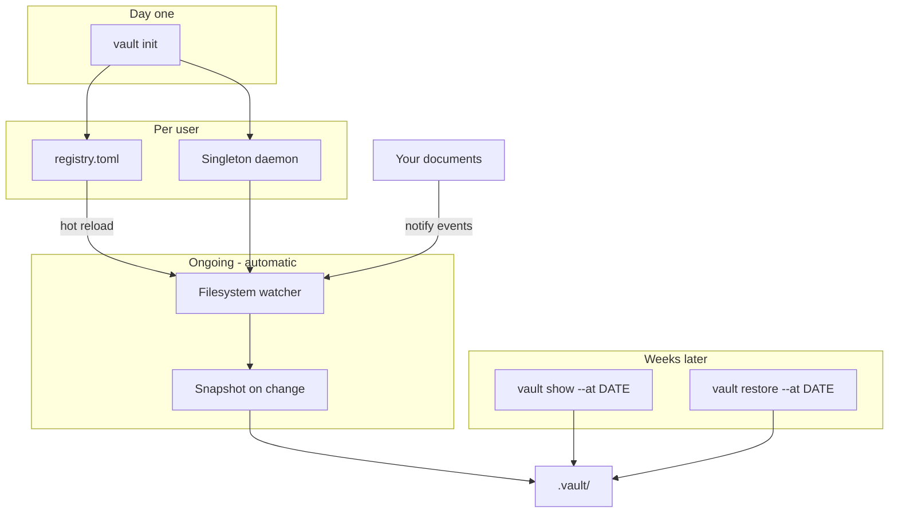
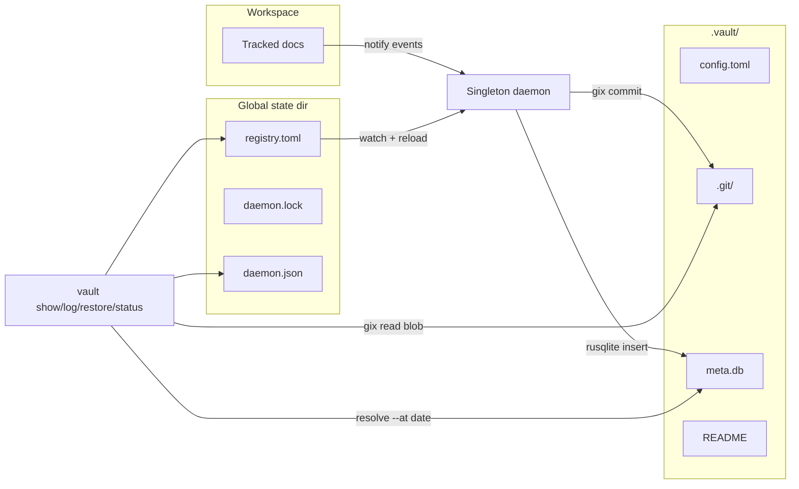

# Architecture

Vault is a **Linux-first CLI** for automatic version history. Users run `vault init` once;
a background watcher records every change. Later, `vault show` and `vault restore` resolve file
content at a wall-clock timestamp.

## High-level flow





## `.vault/` layout

After `vault init` (Chapter 3), each vault root contains:

```text
.vault/
├── README              # Plain-English layout guide (no tool required)
├── config.toml         # Scope, ignore globs, watcher settings
├── .git/               # Standard Git dir (objects + refs = source of truth)
└── meta.db             # SQLite index for fast time-based queries
```

| Store | Holds | Why |
|-------|-------|-----|
| **Git** (`.git/`) | Blob content, commits, trees | Standard git object store; written/read via **gix** in Rust — no `git` CLI dependency |
| **SQLite** (`meta.db`) | File path → commit SHA, wall-clock timestamp, event type | Fast "latest version before DATE" without scanning full git history |
| **config.toml** | Watched roots, ignore patterns, vault metadata | Sensible defaults; rarely edited |

Vault uses a **separated git-dir** inside `.vault/.git/`. The work-tree is the vault root.
Vault never writes a `.git` file at the project root, so it can coexist with an existing
source-control repository (foreign `.git/` directories at the project root are ignored by default).

## Global state (singleton daemon)

One background process per user watches **all** registered vaults. `vault init` appends the
vault root to a global registry and ensures the daemon is running.

| Path (Linux) | Purpose |
|--------------|---------|
| `~/.local/share/vault/registry.toml` | Registered vault roots (human-readable, hand-editable) |
| `~/.local/share/vault/registry.lock` | Mutex for atomic registry updates |
| `~/.local/share/vault/daemon.lock` | Advisory lock — singleton enforcement |
| `~/.local/share/vault/daemon.json` | Heartbeat: pid, started_at, updated_at, vault_count, version |
| `~/.local/share/vault/daemon.log` | Append-only daemon log |

Override the state directory with `VAULT_STATE_DIR` (tests and power users). macOS and Windows
paths follow `directories::ProjectDirs` conventions.

```toml
# registry.toml
version = 1

[[vault]]
root = "/home/me/notes"
registered_at = "2026-07-30T12:00:00Z"
enabled = true
```

The daemon watches `registry.toml` with the same `notify` backend used for document files, so new
vaults are picked up without restart. Writes are atomic: acquire `registry.lock`, write
`registry.toml.tmp`, then `rename` over the target.

## Internal implementation (not user-facing)

The crate follows a **ports-and-adapters** layout:

| Layer | Role |
|-------|------|
| `domain/` | Pure types (`RelPath`, `VaultLayout`, `FileChange`) — no I/O |
| `ports/` | Trait boundaries (`ObjectStore`, `MetaIndex`, `RegistryStore`, `ServiceManager`, `Clock`) |
| `adapters/` | Production and test implementations (gix, SQLite, TOML registry, systemd) |
| `app/` | Use-cases (`init`, `snapshot`, `status`, `prune`, `add_ignore`) |
| `cli/`, `daemon/`, `watcher/` | Presentation and long-running runtime |

Git commits are written by the `GixObjectStore` adapter (`src/adapters/gix.rs`), backed by `src/storage/git.rs` helpers using **gix**. Vault never shells out to the `git` binary. On each snapshot:

- A gix commit records changed blobs with messages like `vault: update docs/arch.md @ 2026-07-29T14:32:01Z`
- A row is inserted into SQLite linking paths, commit SHA, and timestamps

The singleton background watcher (Chapter 4) uses `notify` (inotify on Linux, FSEvents on macOS,
`ReadDirectoryChangesW` on Windows) with debouncing. Watching starts automatically on `vault init`
via a **systemd user unit** (`vault-watcher.service`) when available; otherwise the CLI spawns a
detached `vault daemon` child and warns that login autostart is not configured.

See the [CLI reference](cli.md) for user-facing commands.

## Inspect without `vault`

Normal users never need this section. Artifacts are portable by design so power users and
forensics can recover data without the tool.

### `.vault/README`

Created at `vault init` (Chapter 3). Plain-English description of the layout and recovery steps.

### Git CLI (optional)

Because `.vault/.git/` is a standard object store, you can inspect history with the system `git`
binary:

```bash
git --git-dir=.vault/.git log --oneline
git --git-dir=.vault/.git show HEAD:README.md
```

Vault does not invoke `git` internally, but the on-disk layout is compatible.

### SQLite (optional)

Inspect the time index:

```bash
sqlite3 .vault/meta.db ".schema"
```

Schema created at init (Chapter 3):

```sql
CREATE TABLE snapshots (
    id INTEGER PRIMARY KEY,
    commit_sha TEXT NOT NULL,
    created_at TEXT NOT NULL  -- ISO-8601 UTC
);
CREATE TABLE file_events (
    id INTEGER PRIMARY KEY,
    snapshot_id INTEGER REFERENCES snapshots(id),
    path TEXT NOT NULL,
    event_type TEXT NOT NULL,  -- create | modify | delete
    UNIQUE(snapshot_id, path)
);
CREATE INDEX idx_file_events_path_time ON file_events(path, snapshot_id);
```

Example query (after snapshots exist):

```sql
SELECT s.created_at, f.path, f.event_type
FROM file_events f
JOIN snapshots s ON f.snapshot_id = s.id
ORDER BY s.created_at DESC
LIMIT 20;
```

### Coexistence with project Git

Vault stores git metadata only under `.vault/.git/`. Your project's own `.git/` at the repo root
is untouched.
